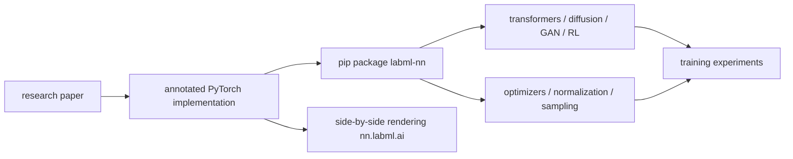

# labmlai/annotated_deep_learning_paper_implementations

> **One sentence.** A collection of commented PyTorch implementations of deep learning papers, readable as side-by-side notes.

## The problem

Going from a paper to the exact line of code that implements it usually means digging through
uncommented research repositories. Here the implementation and its explanation sit next to each
other, paper by paper.

## What it actually does

The repository gathers simple PyTorch implementations of neural networks and related algorithms,
documented with explanations. The `nn.labml.ai` website renders them as side-by-side formatted
notes.

Coverage includes transformers (multi-headed attention, Transformer XL, RoPE, ALiBi, RETRO,
Switch Transformer, FNet, ViT, Triton Flash Attention, a JAX implementation), LoRA, Eleuther
GPT-NeoX with LLM.int8(), diffusion models (DDPM, DDIM, latent diffusion, Stable Diffusion),
GANs (original, DCGAN, CycleGAN, Wasserstein, StyleGAN 2), LSTM, HyperNetworks, ResNet,
ConvMixer, capsule networks, U-Net, Sketch RNN, graph networks (GAT, GATv2), CFR, reinforcement
learning (PPO with GAE, DQN with dueling network and prioritized replay), optimizers (Adam,
AMSGrad, Noam, RAdam, AdaBelief, Sophia-G), normalization layers (batch, layer, instance, group,
weight standardization, DeepNorm), distillation, PonderNet, evidential uncertainty, FTA
activations, language model sampling (greedy, temperature, top-k, nucleus) and Zero3 memory
optimizations.

It is executable teaching material, not a training framework.

## How it is wired



No code-derived diagram exists for this repository; the graph above is rebuilt from the README's
table of contents.

## Trying it

```bash
pip install labml-nn
```

That is the only command documented in the README. Everything else goes through reading the
pages on `nn.labml.ai`.

## Cost and gotchas

The code is free and pip-installable. Hardware depends on what you run: the README explicitly
mentions "Generate on a 48GB GPU" and "Finetune on two 48GB GPUs" for GPT-NeoX, and the
transformer, diffusion and StyleGAN 2 implementations assume a GPU. No API key, no account, no
third-party service is mentioned. The README claims new implementations "almost weekly", yet its
contents stop at an earlier generation of work (Sophia-G, Stable Diffusion, Zero3) — worth
checking before treating it as an up-to-date reference.

## What it is not

It is not a training library meant for production: the implementations are written to be read,
so they are simple rather than optimized or distributed. It is not a pre-trained model zoo
either — no downloadable weights are mentioned. And it is not a certified reproduction of paper
results: the README promises explanations, not reproduced numbers.

## Alternatives

No genuinely comparable alternative among the catalogue neighbours: `pytorch-lightning`
structures training without explaining architectures, `wandb` tracks experiments, `AutoGPTQ`
quantizes models and `physicsnemo` targets physics. This repository fills the teaching slot —
reading an architecture line by line — that none of the four covers.

## Why it matters to you

For a data / AI profile it is the reference to open when a paper stays vague: attention,
diffusion or PPO written in readable PyTorch. Treat it as a reading manual and a base to copy
from, not as a dependency in an MLOps pipeline.
