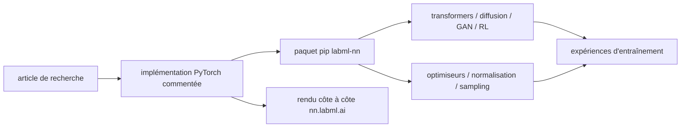

# labmlai/annotated_deep_learning_paper_implementations

> **Une phrase.** Une collection d'implémentations PyTorch commentées ligne à ligne d'articles de deep learning, lisibles en notes côte à côte.

## Le problème

Lire un article de deep learning et retrouver le geste exact dans du code demande de fouiller
des dépôts de recherche non commentés. Ici l'implémentation et l'explication sont posées côte
à côte, article par article.

## Ce que ça fait vraiment

Le dépôt regroupe des implémentations PyTorch simples de réseaux de neurones et d'algorithmes
associés, documentées avec des explications. Le site `nn.labml.ai` rend ces fichiers sous forme
de notes formatées côte à côte (code à gauche, commentaire à droite).

Le catalogue couvre les transformers (attention multi-tête, Transformer XL, RoPE, ALiBi, RETRO,
Switch Transformer, FNet, ViT, Flash Attention en Triton, une implémentation JAX), LoRA,
GPT-NeoX d'Eleuther avec LLM.int8(), les modèles de diffusion (DDPM, DDIM, latent diffusion,
Stable Diffusion), les GAN (original, DCGAN, CycleGAN, Wasserstein, StyleGAN 2), LSTM,
HyperNetworks, ResNet, ConvMixer, capsule networks, U-Net, Sketch RNN, les réseaux de graphes
(GAT, GATv2), CFR, le RL (PPO avec GAE, DQN avec dueling network et prioritized replay), les
optimiseurs (Adam, AMSGrad, Noam, RAdam, AdaBelief, Sophia-G), les couches de normalisation
(batch, layer, instance, group, weight standardization, DeepNorm), la distillation, PonderNet,
l'incertitude évidentielle, les activations FTA, les techniques d'échantillonnage de modèles de
langue (greedy, température, top-k, nucleus) et les optimisations mémoire Zero3.

C'est de la matière pédagogique exécutable, pas un framework d'entraînement.

## Comment c'est branché



Aucun diagramme tiré du code n'est disponible pour ce dépôt : ce schéma est reconstruit depuis
le sommaire du README.

## Essayer

```bash
pip install labml-nn
```

C'est la seule commande documentée dans le README. Le reste du parcours passe par la lecture
des pages du site `nn.labml.ai`, pas par des commandes.

## Coût et pièges

Le code est gratuit et installable par pip. Le matériel, lui, dépend de ce qu'on exécute : le
README indique explicitement « Generate on a 48GB GPU » et « Finetune on two 48GB GPUs » pour
GPT-NeoX. Les implémentations de transformers, de diffusion ou de StyleGAN 2 supposent un GPU.
Aucune clé d'API, aucun compte, aucun service tiers n'est mentionné. Le README annonce des
ajouts « presque chaque semaine », mais son contenu s'arrête à des travaux d'une génération
déjà passée (Sophia-G, Stable Diffusion, Zero3) : à vérifier avant d'en faire une référence à
jour.

## Ce que ce n'est pas

Ce n'est pas une bibliothèque d'entraînement à mettre en production : les implémentations sont
écrites pour être lues, donc simples, pas optimisées ni distribuées. Ce n'est pas non plus un
zoo de modèles pré-entraînés — rien n'indique de poids téléchargeables. Et ce n'est pas une
reproduction certifiée des résultats des articles : le README promet des explications, pas des
chiffres reproduits.

## Alternatives

Aucune alternative réellement comparable parmi les voisins du catalogue : `pytorch-lightning`
structure l'entraînement sans expliquer les architectures, `wandb` suit les expériences,
`AutoGPTQ` quantifie des modèles et `physicsnemo` cible la physique. Ce dépôt occupe la place
pédagogique — lire une architecture ligne à ligne — qu'aucun des quatre ne remplit.

## Pour toi

Pour un profil data / IA, c'est la référence à ouvrir quand un article reste flou : on y voit
l'attention, la diffusion ou le PPO écrits en PyTorch lisible. À traiter comme un manuel de
lecture et une base à recopier, pas comme une dépendance d'un pipeline MLOps.
