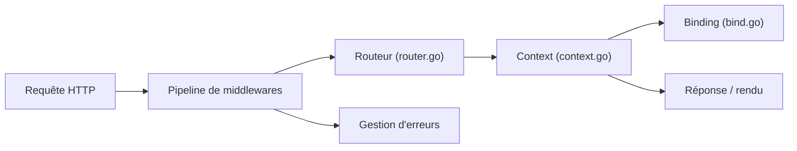

# labstack/echo

> Framework web Go minimaliste au-dessus de net/http, avec routeur, binding et middlewares.

## Le problème
Le paquet net/http laisse à ta charge le routage avancé, le binding de requêtes, la gestion centralisée des erreurs et les middlewares.

## Ce que ça fait vraiment
Ajoute un routeur à arbre radix, des groupes de routes, des middlewares au niveau racine, groupe ou route, le binding JSON, XML et formulaire avec validateur enfichable, le rendu de templates et une gestion d'erreurs centralisée. Il gère TLS automatique (Let's Encrypt) et HTTP/2. La version actuelle est v5. Des dépôts officiels apportent JWT, OpenTelemetry et Prometheus.

## Comment c'est branché


## Essayer
```bash
go get github.com/labstack/echo/v5
```
Le README contient un exemple Go complet avec e.Use(middleware.RequestLogger()), e.GET et e.Start(":8080").

## Coût et pièges
Gratuit ; la dernière version supporte les quatre dernières versions majeures de Go. Le README avertit que les middlewares tiers ne sont pas garantis par l'équipe.

## Ce que ce n'est pas
Ce n'est pas un framework complet à la beego : pas d'ORM ni de gestion de sessions intégrés. Les middlewares tiers listés sont hors garantie.

## Alternatives
Aucune alternative citée dans le README.

## Pour toi
À surveiller : bon choix pour une API Go légère devant un modèle, mais hors périmètre si ta pile est Python.

