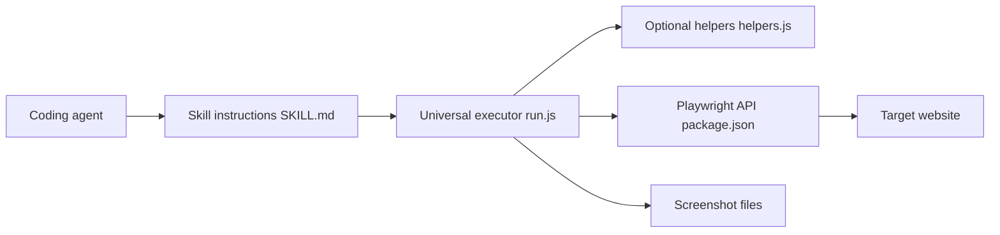

# lackeyjb/playwright-skill

> Skill d'agent qui laisse un assistant de code écrire et exécuter des scripts Playwright à la demande.

## Le problème
Un agent qui automatise un navigateur a besoin d'un exécuteur fiable, d'une résolution de modules stable et de consignes sur Playwright.

## Ce que ça fait vraiment
Un skill (`SKILL.md`) et une référence d'API (`API_REFERENCE.md`) chargés à la demande. Un exécuteur universel `run.js` lance les scripts écrits par l'agent, avec des helpers optionnels. Navigateur visible par défaut (`headless: false`), captures d'écran et console renvoyées. Installable comme skill ou plugin Claude Code.

## Comment c'est branché


## Essayer
```bash
npx skills add lackeyjb/playwright-skill --skill playwright-skill --global --yes
npm run setup
```
Ou, dans Claude Code : `/plugin marketplace add lackeyjb/playwright-skill` puis `/plugin install playwright-skill@playwright-skill`.

## Coût et pièges
Node, Playwright et Chromium installés par `npm run setup`. Les scripts écrits par l'agent s'exécutent localement dans un navigateur visible.

## Ce que ce n'est pas
Pas le plus simple pour du pilotage interactif : le README recommande `@playwright/cli` ou `playwright-mcp` pour cela. Ici l'intérêt est de garder un script rejouable.

## Alternatives
- `@playwright/cli` (Microsoft) : navigation interactive simple.
- `playwright-mcp` : contrôle par outils avec snapshots d'accessibilité.

## Pour toi
À surveiller : utile si tu veux que ton agent produise des tests ou scrapers Playwright réutilisables ; sinon les options officielles suffisent.

