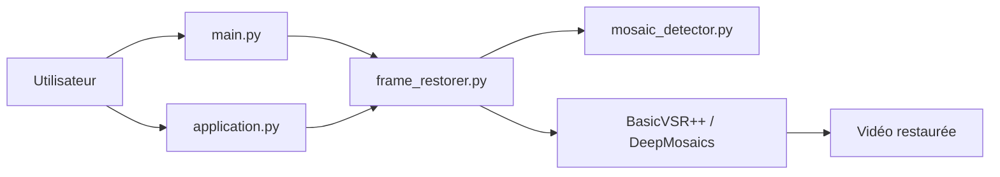

# ladaapp/lada

> Outil de restauration vidéo qui retire la pixellisation des vidéos pour adultes japonaises.

## Le problème
Les vidéos censurées par mosaïque sont dégradées ; le but est de reconstituer les zones pixellisées.

## Ce que ça fait vraiment
Traite la vidéo image par image : détection de mosaïque (segmentation YOLO) puis restauration par BasicVSR++ ou DeepMosaics. Interface graphique (lecture en temps réel ou export) et CLI `lada-cli --input`. Le README prévient que la qualité varie, parfois pire que la mosaïque d'origine.

## Comment c'est branché


## Essayer
```bash
lada-cli --input <input video path>
docker pull ladaapp/lada:latest
flatpak run io.github.ladaapp.lada
```

## Coût et pièges
GPU avec 4 à 6 Go de VRAM conseillés (Nvidia Turing ou plus récent, Intel Arc), 6 à 8 Go de RAM en 1080p, davantage en 4K. Sans GPU c'est impraticable. Le foyer du projet est Codeberg, GitHub est un miroir.

## Ce que ce n'est pas
Pas un outil généraliste de restauration vidéo : il vise un contenu précis. Il n'est pas adapté à une chaîne professionnelle.

## Alternatives
Aucune alternative nommée dans le README.

## Pour toi
Ignorer : application grand public à contenu adulte, sans valeur pour ton travail ; seul l'angle technique (pipeline détection+restauration) est instructif.

