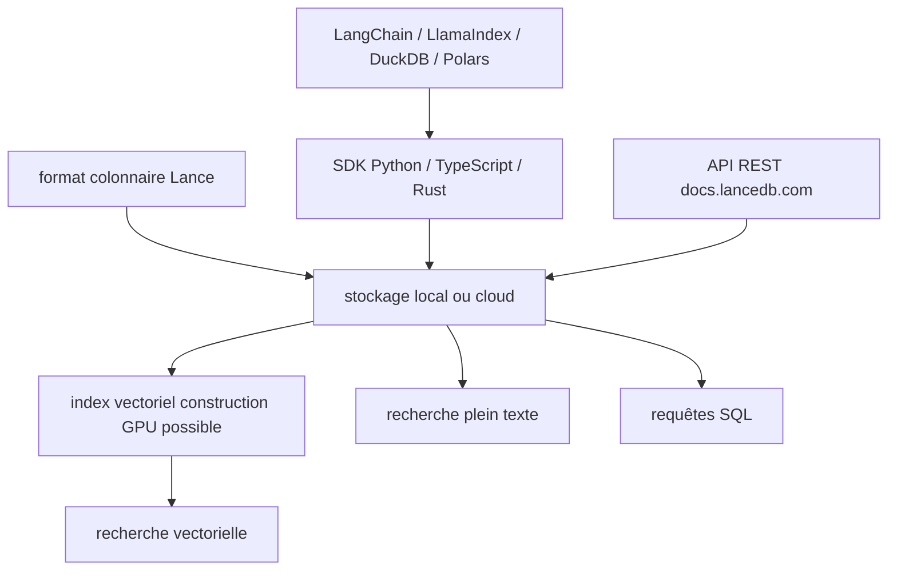

# lancedb/lancedb

> Base de données multimodale et recherche vectorielle embarquable, bâtie sur le format colonnaire Lance.

## Le problème
Stocker vecteurs, métadonnées et données multimodales dans trois systèmes différents force à les synchroniser à la main.
Faire du versionnement de jeux de données demande d'habitude une infrastructure dédiée.

## Ce que ça fait vraiment
Stocke, indexe et interroge vecteurs, métadonnées et données multimodales (texte, images, vidéos, nuages de points) sur le format colonnaire Lance.
Trois modes de recherche : similarité vectorielle, recherche plein texte et SQL, sur le même stockage.
Zero-copy et versionnement automatique des données, sans infrastructure supplémentaire ; le GPU peut servir à construire l'index.
SDK Python, Node.js/TypeScript, Rust et API REST ; intégrations LangChain, LlamaIndex, Arrow, Pandas, Polars, DuckDB.

## Comment c'est branché

## Essayer
Aucune commande d'installation dans le README : il renvoie au Quickstart et aux pages de SDK.

## Coût et pièges
L'open source tourne en local ou dans votre cloud ; les offres Cloud et Enterprise sont payantes, donc freemium.
Piège : le README est promotionnel et ne donne aucune commande — l'évaluation réelle commence par le Quickstart externe.

## Ce que ce n'est pas
Pas un moteur d'embedding : il indexe des vecteurs, il ne les produit pas.
Pas un entrepôt analytique généraliste, malgré le mot « lakehouse » : l'entrée est la recherche vectorielle.
Pas un service géré dans sa version open source : l'absence de serveur à gérer est la promesse de l'offre Cloud.

## Alternatives
Aucune alternative nommée ; les dépôts cités (LangChain, LlamaIndex, DuckDB, Polars) sont des intégrations.

## Pour toi
Bon choix de base vectorielle embarquée quand tu veux versionner tes données et éviter un service à opérer.
