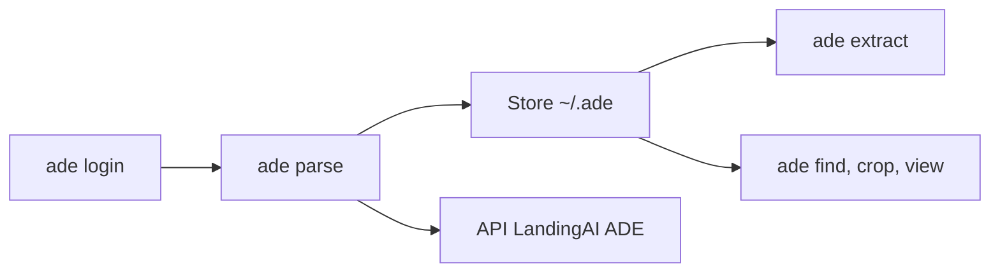

# landing-ai/agentic-doc

> CLI de LandingAI pour extraire texte et champs structurés de documents avec preuves de position.

## Le problème
Extraire tableaux, figures et champs d'un PDF, en sachant d'où vient chaque valeur, est laborieux.

## Ce que ça fait vraiment
`ade parse` produit du Markdown, des éléments et le repérage page-et-boîte ; `ade extract` remplit un schéma JSON avec la preuve de chaque champ ; `ade find` cherche localement, `ade crop` exporte une région en PNG, `ade view` ouvre un visualiseur HTML. Tout est stocké dans `~/.ade` : relancer une commande identique ne consomme pas de crédits. Sortie `--json` pour les agents.

## Comment c'est branché


## Essayer
```sh
curl -fsSL https://raw.githubusercontent.com/landing-ai/ade-cli/main/scripts/install.sh | sh
ade login
ade parse -d invoice.pdf
ade extract JOB_ITEM_ID --schema schema.json
```

## Coût et pièges
Compte et clé d'API (`ADE_API_KEY`) requis ; l'analyse consomme des crédits. Ne jamais supprimer tout `~/.ade` : il contient des résultats déjà payés.

## Ce que ce n'est pas
Ce n'est plus le SDK Python `agentic-doc` : il est conservé sans développement sur la branche `legacy`, et le dépôt livre la CLI depuis le 2026-07-31. Le schéma d'architecture fourni décrit l'ancien SDK.

## Alternatives
Aucune alternative nommée dans le README.

## Pour toi
À surveiller : utile pour l'extraction de documents à grande échelle, mais dépendant d'un SaaS payant et licence non déclarée.
