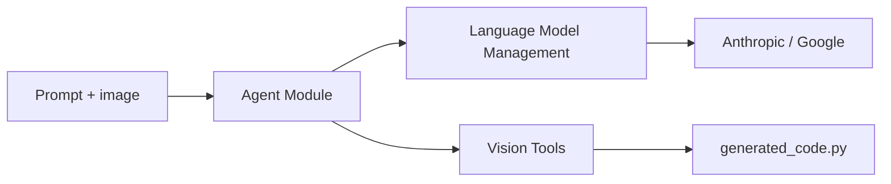

# landing-ai/vision-agent

> Agent qui transforme une consigne et une image en code de vision exécutable, pour développeurs d'applications visuelles.

## Le problème
Choisir et enchaîner les bons modèles de vision (détection, comptage, suivi) pour une tâche donnée est long.

## Ce que ça fait vraiment
`VisionAgentCoderV2` planifie, génère du code et un test, puis itère jusqu'à ce que le test passe. Les outils (détection, comptage, suivi vidéo, superposition) sont aussi appelables seuls via `vision_agent.tools`. Modèles par défaut : Claude 3.7 Sonnet et Gemini Flash 2.0, configurables dans `vision_agent/configs/config.py`.

## Comment c'est branché


## Essayer
```bash
pip install vision-agent
export VISION_AGENT_API_KEY="your-api-key"
export ANTHROPIC_API_KEY="your-api-key"
export GOOGLE_API_KEY="your-api-key"
```

## Coût et pièges
Trois clés : VisionAgent, Anthropic et Google, avec leurs quotas. Les outils s'appuient sur des modèles servis par LandingAI. Dernier push en janvier 2026.

## Ce que ce n'est pas
Pas un modèle de vision autonome : il dépend de LLM externes et de l'API LandingAI. Le code généré doit être vérifié.

## Alternatives
Le README ne nomme aucune alternative.

## Pour toi
À surveiller : pratique pour prototyper de la vision, mais trois comptes payants ou limités en font une dépendance externe.
