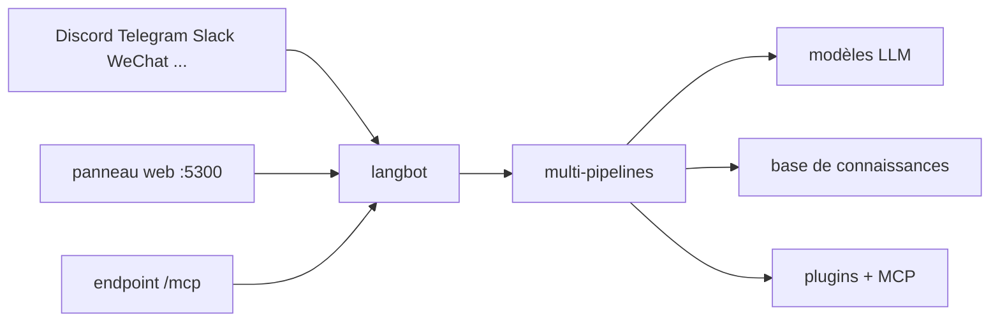

# langbot-app/LangBot

> Plateforme pour brancher un agent LLM sur des messageries : Slack, Discord, Telegram, WeChat et d'autres.

## Le problème
Livrer le même assistant sur Slack, Discord, Telegram et WeCom veut dire quatre intégrations à maintenir.
Et chaque plateforme a ses formats de message, ses limites de débit et ses contraintes de modération.

## Ce que ça fait vraiment
Un seul code pour Discord, Telegram, Slack, LINE, QQ, WeChat, WeCom, Lark, DingTalk, KOOK.
Dialogues multi-tours, appel d'outils, multimodal, sortie en flux, et RAG intégré relié à Dify, Coze, n8n, Langflow.
Contrôle d'accès, limitation de débit, filtrage de mots sensibles, supervision et gestion d'exceptions.
Panneau web de configuration sur `http://localhost:5300` : pas de YAML à éditer à la main.

## Comment c'est branché


## Essayer
```bash
uvx langbot
```
Ou en conteneurs : `git clone https://github.com/langbot-app/LangBot`, `cd LangBot/docker`,
`docker compose --profile all up -d`.

## Coût et pièges
Il faut `uv` pour le lancement en une ligne, et tes propres clés de modèle. LangBot Cloud existe
en version hébergée : c'est un service tiers, pas le même périmètre que l'auto-hébergement.

## Ce que ce n'est pas
Pas un agent : c'est le transport et la gouvernance autour d'un agent que tu configures.
Pas une base de connaissances : le RAG s'appuie sur des intégrations externes (Dify, Coze, Weknora).
Pas neutre sur l'écosystème : une bonne part des plateformes couvertes est chinoise (QQ, WeCom, Lark, DingTalk).

## Alternatives
`Dify`, `Coze`, `n8n`, `Langflow`, `Deerflow`, `Weknora` — intégrés, donc utilisables directement si le bot IM n'est pas ton besoin.

## Pour toi
Utile le jour où un assistant interne doit vivre dans Slack ou Teams ; sinon c'est de la plomberie de messagerie.
