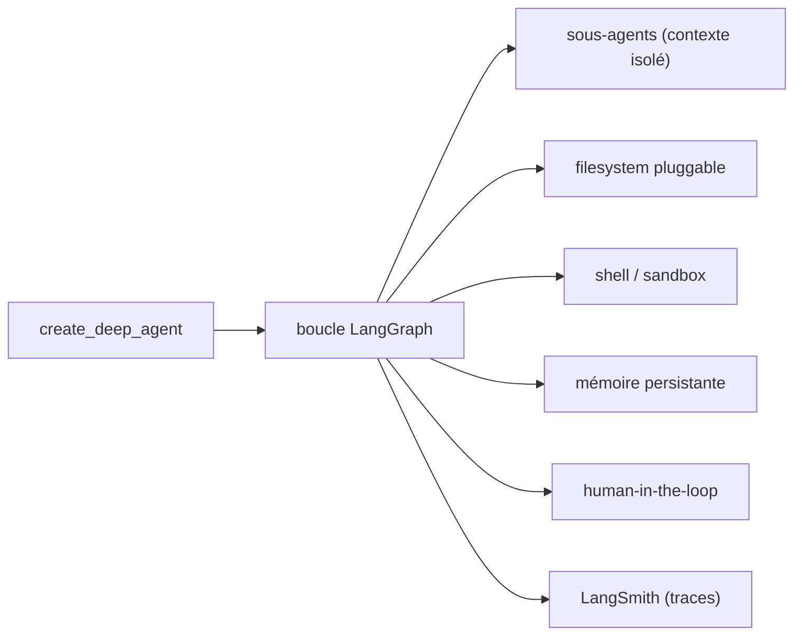

# langchain-ai/deepagents

> Harnais d'agent prêt à l'emploi pour tâches longues, construit sur LangGraph.

## Le problème
Un agent qui travaille des heures perd son contexte, oublie ses fichiers et ne sait pas déléguer.
Assembler soi-même sous-agents, système de fichiers et compactage de contexte revient à réécrire un harnais.

## Ce que ça fait vraiment
`create_deep_agent` rend un agent qui planifie, lit/écrit des fichiers et gère son propre contexte.
Sous-agents à fenêtre isolée, backends de fichiers locaux/sandbox/distants, accès shell, mémoire persistante.
Human-in-the-loop : approuver, modifier ou refuser un appel d'outil avant exécution ; skills chargeables à la demande.
Tout composant se remplace sans forker ; n'importe quel `CompiledStateGraph` LangGraph s'y branche comme sous-agent.

## Comment c'est branché


## Essayer
```bash
uv add deepagents
curl -LsSf https://langch.in/dcode | bash
```

## Coût et pièges
Le modèle est à ta charge : clé d'API frontière, fournisseur open-weight, ou modèle local via Ollama, vLLM, llama.cpp.
Le tracing, l'évaluation et le déploiement passent par LangSmith, un service tiers.

## Ce que ce n'est pas
Ce n'est pas une sandbox de sécurité : le modèle de confiance est « trust the LLM », les limites se posent au niveau des outils.
Ce n'est pas LangGraph : c'est une couche opinionée au-dessus de `create_agent`, elle-même au-dessus du runtime graphe.
Ce n'est pas le bon outil si la boucle d'agent n'est pas la forme voulue — il faut alors descendre à LangGraph.

## Alternatives
LangChain `create_agent` : harnais minimal, sans le middleware embarqué, quand on veut moins.
LangGraph : le runtime graphe brut, quand la boucle d'agent ne correspond pas au besoin.
deepagents.js : la même bibliothèque pour JavaScript/TypeScript.

## Pour toi
À regarder si tu es déjà sur LangGraph ; sinon le coût d'entrée dans l'écosystème dépasse le gain.
