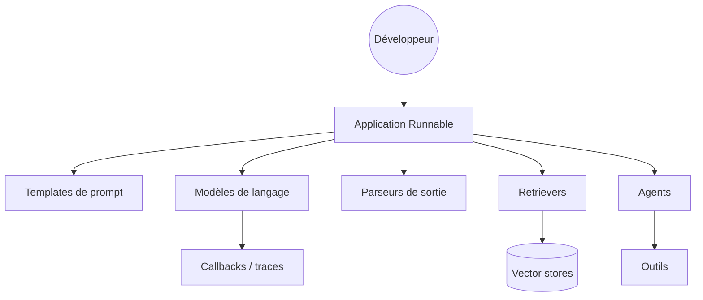

# langchain-ai/langchain

> Bibliothèque Python d'abstractions communes pour modèles, outils et retrieval, pour développeurs LLM.

## Le problème
Chaque fournisseur de modèles a son SDK, son format de message et sa syntaxe d'appel d'outils.
Changer de modèle en cours de projet oblige à réécrire la couche d'appel.

## Ce que ça fait vraiment
Interface unique pour modèles de chat, embeddings, vector stores, retrievers et outils.
`init_chat_model("openai:gpt-5.5")` puis `.invoke()` : le même code vaut pour un autre fournisseur.
Fournit une API d'indexation qui suit les documents déjà indexés dans un registre SQL.
Système de callbacks et de traces, branchable sur LangSmith pour l'observabilité.

## Comment c'est branché


## Essayer
```bash
uv add langchain
```
```python
from langchain.chat_models import init_chat_model
model = init_chat_model("openai:gpt-5.5")
result = model.invoke("Hello, world!")
```

## Coût et pièges
La bibliothèque est gratuite ; les appels de modèles sont facturés par ton fournisseur.
LangSmith, présenté comme le compagnon d'observabilité, est un service payant séparé.

## Ce que ce n'est pas
Pas un framework d'orchestration : pour des workflows contrôlables, le README renvoie à LangGraph.
Les abstractions ont un coût — une couche de plus entre ton code et l'API du fournisseur.
« Production-ready » et « battle-tested » sont du vocabulaire du README, pas une garantie.

## Alternatives
- `langflow-ai/langflow` : la même chose, en visuel, pour maquetter sans code.
- `browser-use/browser-use` : si le besoin est un agent navigateur, pas une couche d'abstraction.

## Pour toi
Le standard de fait ; utile surtout pour l'interopérabilité des modèles. À connaître, à doser.
