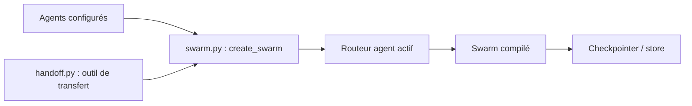

# langchain-ai/langgraph-swarm-py

> Bibliothèque Python pour des essaims d'agents LangGraph qui se passent la main selon leur spécialité.

## Le problème
Dans un système multi-agents, il faut décider quel agent répond et se souvenir de celui qui était actif au tour précédent.

## Ce que ça fait vraiment
`create_swarm` assemble des agents dans un graphe LangGraph ; `create_handoff_tool` génère l'outil de transfert entre agents. Le dernier agent actif est mémorisé dans l'état, à condition de compiler avec un checkpointer. Par défaut, tout l'historique de messages passe lors du transfert ; outils de transfert et schémas d'état sont personnalisables. Mémoire courte et longue, streaming et validation humaine viennent de LangGraph.

## Comment c'est branché


## Essayer
```bash
pip install langgraph-swarm
pip install langgraph-swarm langchain-openai
export OPENAI_API_KEY=<your_api_key>
```

## Coût et pièges
Clé d'API du modèle choisi (l'exemple utilise OpenAI). Sans checkpointer, l'essaim oublie l'agent actif et l'historique.

## Ce que ce n'est pas
Pas un framework autonome : il dépend de LangGraph. Les messages de tous les agents sont fusionnés par défaut, ce qui expose leur historique interne.

## Alternatives
Aucune alternative nommée dans le README.

## Pour toi
À surveiller : petit et utile si tu es déjà sur LangGraph ; dernier push en juillet 2026, à vérifier avant de bâtir dessus.

