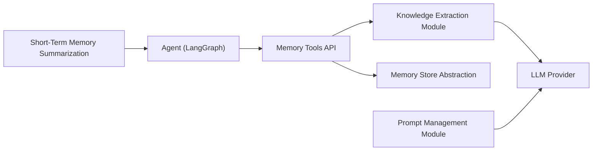

# langchain-ai/langmem

> Bibliothèque de mémoire à long terme pour agents LangGraph, qui extrait et retrouve des informations de conversation.

## Le problème
Un agent oublie tout d'une session à l'autre et ne s'adapte pas aux préférences de l'utilisateur.

## Ce que ça fait vraiment
Fournit des outils mémoire (`create_manage_memory_tool`, `create_search_memory_tool`) que l'agent appelle pendant la conversation, un gestionnaire de mémoire en arrière-plan qui extrait et consolide les connaissances, l'optimisation de prompts et la synthèse de contexte court terme. Stockage via le `BaseStore` de LangGraph (`InMemoryStore` volatile, `AsyncPostgresStore` pour persister).

## Comment c'est branché


## Essayer
```bash
pip install -U langmem
export ANTHROPIC_API_KEY="sk-..."
```
```python
from langgraph.prebuilt import create_react_agent
from langgraph.store.memory import InMemoryStore
from langmem import create_manage_memory_tool, create_search_memory_tool
```

## Coût et pièges
Clé d'un fournisseur LLM ; l'exemple utilise des embeddings OpenAI. Les appels d'extraction et de recherche consomment des jetons à ta charge ; `InMemoryStore` perd tout au redémarrage.

## Ce que ce n'est pas
Pas une base de connaissances autonome : elle s'appuie sur LangGraph et un LLM pour décider quoi retenir. La qualité de la mémoire n'est pas mesurée dans le README.

## Alternatives
Aucune alternative nommée dans le README.

## Pour toi
À surveiller : simple à intégrer si tu es déjà sur LangGraph ; sans LangGraph, l'intérêt baisse nettement.
