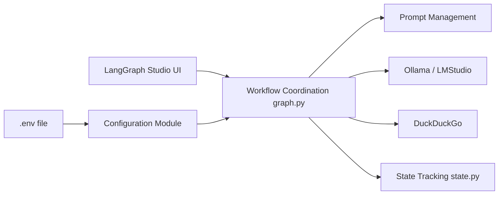

# langchain-ai/local-deep-researcher

> Graphe LangGraph de recherche web itérative qui tourne avec un LLM local via Ollama ou LMStudio.

## Le problème
Les assistants « deep research » reposent sur des API payantes et envoient tes requêtes au cloud.

## Ce que ça fait vraiment
À partir d'un sujet, le LLM local génère une requête, un moteur (DuckDuckGo par défaut, sinon SearXNG, Tavily, Perplexity) renvoie des sources, le LLM résume, repère les manques et relance, pour un nombre de boucles réglable. Sortie : un résumé Markdown avec citations, visible dans LangGraph Studio. Un repli gère les modèles qui ratent la sortie JSON.

## Comment c'est branché


## Essayer
```bash
git clone https://github.com/langchain-ai/local-deep-researcher.git
cd local-deep-researcher
cp .env.example .env
ollama pull deepseek-r1:8b
uvx --refresh --from "langgraph-cli[inmem]" --with-editable . --python 3.11 langgraph dev
docker build -t local-deep-researcher .
```

## Coût et pièges
Gratuit avec Ollama et DuckDuckGo ; Tavily ou Perplexity demandent une clé. L'UI Studio est servie par smith.langchain.com, souci connu sur Safari.

## Ce que ce n'est pas
Pas un produit fini avec interface propre : c'est un graphe à lancer dans LangGraph. Le Dockerfile n'embarque pas Ollama.

## Alternatives
- ollama-deep-researcher-ts : portage TypeScript (sans Perplexity) si ta stack est JS.

## Pour toi
À adopter comme gabarit : petit graphe LangGraph lisible, 100 % local, qui montre la boucle requête-résumé-réflexion, idéal à forker pour un assistant de veille interne.
