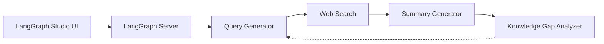

# langchain-ai/ollama-deep-researcher

> Assistant de recherche web local (Local Deep Researcher) qui boucle recherche, résumé et analyse des lacunes avec Ollama ou LMStudio.

## Le problème
Obtenir un résumé sourcé sur un sujet sans envoyer ses requêtes à un LLM hébergé.

## Ce que ça fait vraiment
Un graphe LangGraph : le LLM local génère une requête, la recherche (DuckDuckGo par défaut, Tavily, Perplexity ou SearXNG) ramène des sources, le LLM résume puis identifie les lacunes et relance, jusqu'à 3 cycles par défaut. Sortie : un résumé markdown avec sources, visible dans LangGraph Studio. Inspiré d'IterDRAG.

## Comment c'est branché


## Essayer
```bash
git clone https://github.com/langchain-ai/local-deep-researcher.git
cd local-deep-researcher
cp .env.example .env
ollama pull deepseek-r1:8b
uvx --refresh --from "langgraph-cli[inmem]" --with-editable . --python 3.11 langgraph dev
```

## Coût et pièges
Gratuit avec DuckDuckGo ; clés Tavily ou Perplexity optionnelles. Ollama ou LMStudio à installer. Certains petits modèles (DeepSeek R1 1,5B et 7B) échouent sur le JSON structuré : un repli existe. Le Docker n'inclut pas Ollama.

## Ce que ce n'est pas
Pas un moteur de recherche approfondie de niveau produit : la qualité dépend du modèle local. Le diagramme fourni est sans composants lisibles.

## Alternatives
- ollama-deep-researcher-ts : portage TypeScript sans Perplexity.

## Pour toi
À surveiller : bon exemple pédagogique de boucle de recherche locale sous LangGraph ; à juger sur la qualité de ton modèle.
