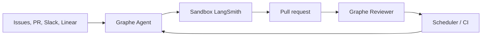

# langchain-ai/open-swe

> Agent de développement logiciel auto-hébergeable qui reçoit une tâche et livre une pull request.

## Le problème
Les agents de code restent des jouets locaux : pas de sandbox persistante, pas d'intégration aux issues,
pas de suivi de CI ni de revue, et rien d'auditable côté permissions dépôt.

## Ce que ça fait vraiment
Reçoit une tâche depuis le dashboard, GitHub, Slack, Linear ou une planification, l'exécute dans une
sandbox Linux isolée liée au thread, puis pousse une PR. Cinq graphes LangGraph séparés : Agent,
Reviewer, Analyzer, Chat, Scheduler. Le Reviewer apprend le style de revue du dépôt ; `/baby-sit`
surveille la CI et relance les jobs flaky avec preuve. Deep Agents fournit plan, fichiers, shell, sous-agents.

## Comment c'est branché


## Essayer
```bash
git clone https://github.com/langchain-ai/open-swe.git
cd open-swe
uv venv
source .venv/bin/activate
uv sync --all-extras
make build-dashboard
make dev
```

## Coût et pièges
Il faut créer une GitHub App et une Slack app, fournir des fournisseurs de modèles, et un tunnel ngrok
pour les webhooks en local. L'auto-hébergement en production exige le LangGraph Agent Server **et sa clé
de licence**. LangSmith est le fournisseur de sandbox par défaut.

## Ce que ce n'est pas
Pas un produit stable : le README annonce que les API et surfaces évoluent encore. Pas gratuit à l'échelle
— sandbox, modèles et licence serveur se facturent. Le client desktop est expérimental, packagé macOS.

## Alternatives
- **Deep Agents** : le harnais seul, si vous voulez construire votre propre outillage.
- **LangGraph** : le runtime durable, sans la couche produit.

## Pour toi
Intéressant comme architecture de référence ; l'adopter suppose d'accepter la dépendance LangSmith.
