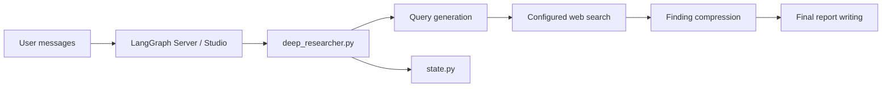

# langchain-ai/open_deep_research

> Agent de recherche approfondie LangGraph configurable, multi-fournisseurs de modèles et de recherche web.

## Le problème
Les agents « deep research » commerciaux sont fermés ; reproduire leur boucle recherche-synthèse sourcée demande beaucoup de plomberie.

## Ce que ça fait vraiment
Un graphe LangGraph (`deep_researcher.py`) génère des requêtes, itère les recherches (Tavily par défaut, recherche native OpenAI/Anthropic ou MCP), résume, compresse puis rédige un rapport.
Quatre modèles distincts (résumé, recherche, compression, rapport), choisis dans `configuration.py`.
Exécuté via LangGraph Server/Studio ; évaluation sur Deep Research Bench via LangSmith.
Deux implémentations anciennes dans `src/legacy/`.

## Comment c'est branché


## Essayer
```bash
git clone https://github.com/langchain-ai/open_deep_research.git
cd open_deep_research
uv venv
source .venv/bin/activate
uv sync
cp .env.example .env
uvx --refresh --from "langgraph-cli[inmem]" --with-editable . --python 3.11 langgraph dev --allow-blocking
```

## Coût et pièges
Clés LLM (OpenAI par défaut) et Tavily à ta charge ; l'évaluation complète coûte 20 à 100 $.
Les modèles doivent gérer sorties structurées et appels d'outils.

## Ce que ce n'est pas
Dépôt archivé : plus de corrections à attendre.
Pas une application prête à l'emploi : c'est un graphe à héberger sur LangGraph.

## Alternatives
Aucune alternative nommée dans le README hors les implémentations legacy du même dépôt.

## Pour toi
À surveiller comme référence d'architecture d'agent de recherche (étapes, modèles séparés, évaluation), mais l'archivage interdit d'en faire une dépendance.
