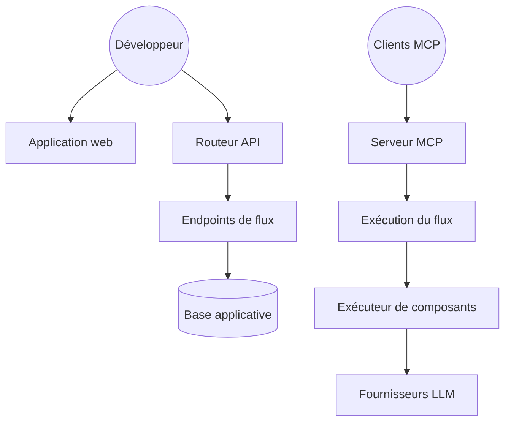

# langflow-ai/langflow

> Éditeur visuel de flux d'agents, qui expose chaque flux en API ou en serveur MCP.

## Le problème
Câbler un agent en code pour chaque variante à tester coûte cher en itérations.
Et une fois le flux au point, il faut encore l'exposer proprement aux applications.

## Ce que ça fait vraiment
Éditeur graphique de flux, avec accès au code Python de chaque composant pour le personnaliser.
Terrain de jeu interactif pour exécuter un flux pas à pas et le corriger.
Déploiement du flux en API REST, en JSON exportable, ou en serveur MCP consommé par un client MCP.
Intégrations d'observabilité (LangSmith, LangFuse) et orchestration multi-agents avec récupération.

## Comment c'est branché


## Essayer
```shell
uv pip install langflow -U
uv run langflow run
docker run -p 7860:7860 langflowai/langflow:latest
```

## Coût et pièges
Le produit est gratuit ; les modèles et bases vectorielles branchés sont à ta charge.
Python 3.10–3.14, `uv` recommandé. Le serveur écoute sur 7860 : ne pas l'exposer tel quel.

## Ce que ce n'est pas
Pas un remplaçant du code : les flux visuels deviennent vite illisibles au-delà d'un certain nombre de nœuds.
Pas un runtime managé : l'hébergement, l'authentification et la montée en charge restent à faire.
« Enterprise-ready » est une affirmation du README, pas une propriété vérifiable ici.

## Alternatives
- `langchain-ai/langchain` : si le flux doit vivre dans le code plutôt que dans un canevas.
- `bytedance/deer-flow` : orchestration de sous-agents, sans éditeur visuel.

## Pour toi
Utile pour maquetter vite avec des non-développeurs ; à ne pas mettre sur le chemin critique.
