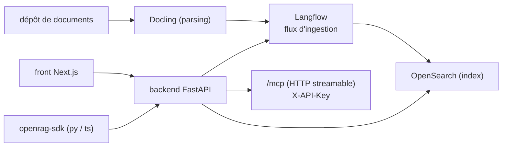

# langflow-ai/openrag

> Plateforme RAG prête à l'emploi : ingestion de documents, recherche sémantique et chat.

## Le problème
Monter un RAG demande d'assembler parseur de documents, index, orchestrateur de récupération et
interface de chat — quatre briques à câbler avant la première question posée.

## Ce que ça fait vraiment
Livre l'ensemble déjà branché : les utilisateurs déposent, traitent et interrogent des documents via
une interface de chat appuyée sur des LLM et de la recherche sémantique. Langflow assure l'ingestion,
les workflows de récupération et les « nudges », avec un constructeur de workflows visuel en
glisser-déposer pour itérer. L'ingestion est annoncée comme tolérante aux données réelles mal
formées, via Docling. L'index est OpenSearch. Le backend est FastAPI, le front Next.js. Des SDK
Python et TypeScript exposent `client.chat.create(...)`. Un serveur MCP en HTTP streamable est monté
sur `/mcp` de l'instance, authentifié par l'en-tête `X-API-Key`, sans sous-processus ni installation
séparée : il donne des outils de chat RAG, recherche sémantique, ingestion, filtres et réglages.

## Comment c'est branché


## Essayer
```bash
pip install openrag-sdk
npm install openrag-sdk
```
Configuration d'un client MCP :
```json
{
  "mcpServers": {
    "openrag": {
      "url": "http://localhost:3000/mcp",
      "headers": { "X-API-Key": "orag_your_api_key_here" }
    }
  }
}
```

## Coût et pièges
Les LLM appelés sont à ta charge. Le déploiement auto-géré demande Docker ou Podman, et la stack
complète (OpenSearch + Langflow + FastAPI + Next.js) n'est pas légère en mémoire. Le paquet PyPI
`openrag-mcp` autonome est **déprécié** : il faut viser l'endpoint `/mcp`.

## Ce que ce n'est pas
Pas une bibliothèque RAG : c'est une plateforme complète, et on hérite de ses choix (OpenSearch,
Langflow, Docling) sans pouvoir en changer facilement. Pas documenté dans le dépôt : installation,
quickstart et déploiement sont tous renvoyés à la documentation externe, et la section « comment ça
marche » du README ne contient aucun texte, seulement un visuel absent.

## Alternatives
- Langflow seul : si le besoin est le constructeur de flux, sans la plateforme autour.

## Pour toi
Le RAG « clés en main » le plus crédible du lot ; à évaluer contre ton propre pipeline OpenSearch.
