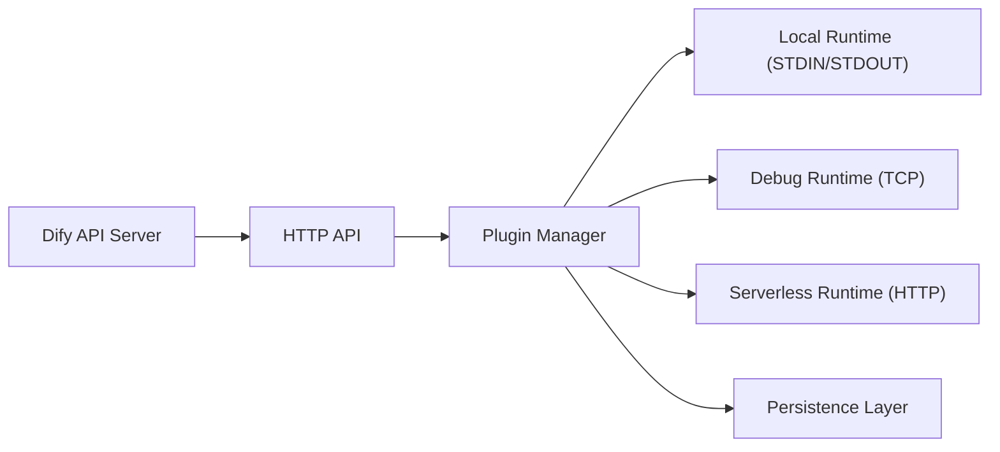

# langgenius/dify-plugin-daemon

> Service qui gère le cycle de vie et l'exécution des plugins de la plateforme Dify, pour opérateurs Dify.

## Le problème
Dify doit installer, isoler et invoquer des plugins par espace de travail, en local comme en serverless.

## Ce que ça fait vraiment
Un démon Go reçoit des requêtes HTTP du serveur API Dify puis les transmet selon trois runtimes : local (sous-processus via STDIN/STDOUT), debug (TCP plein duplex) et serverless (AWS Lambda par HTTP). Il utilise uv pour les dépendances Python des plugins et s'appuie sur une base MySQL/PostgreSQL et Redis. Une CLI (brew ou binaire) aide au développement de plugins.

## Comment c'est branché


## Essayer
```bash
brew tap langgenius/dify
brew install dify
cp .env.example .env
go run github.com/joho/godotenv/cmd/godotenv@latest -f .env go run cmd/server/main.go
go run ./cmd/commandline/ migrate
```

## Coût et pièges
Linux et macOS uniquement. Python 3.11+ et uv à installer. Éviter les volumes réseau pour le répertoire de travail. L'édition communautaire ne monte pas en charge avec plusieurs réplicas.

## Ce que ce n'est pas
Pas utile hors de Dify : ce n'est pas un système de plugins générique. La montée en charge Kubernetes est réservée à une version entreprise.

## Alternatives
Aucune alternative nommée dans le README.

## Pour toi
Surveiller : ne sert que si tu auto-héberges Dify et dois comprendre ses plugins ; sinon, aucun intérêt direct.
