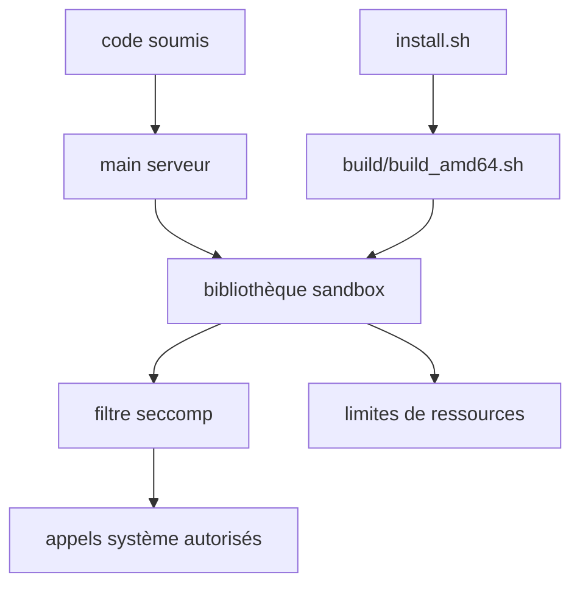

# langgenius/dify-sandbox

> Bac à sable Linux qui exécute du code non fiable en restreignant appels système et ressources.

## Le problème
Laisser un agent ou un utilisateur exécuter du code arbitraire sur un serveur partagé expose la machine entière.
Un simple conteneur ne suffit pas quand plusieurs locataires soumettent du code en même temps.

## Ce que ça fait vraiment
Exécute du code soumis dans un environnement restreint, conçu pour un usage multi-locataires.
La restriction porte sur les ressources et sur les appels système accessibles au code, via `libseccomp`.
Se construit en deux temps : un script d'installation des dépendances, puis un script de build par architecture (amd64 ou arm64).
Le serveur se lance ensuite par un binaire unique.

## Comment c'est branché


## Essayer
```bash
git clone https://github.com/langgenius/dify-sandbox
./install.sh
./build/build_amd64.sh
./main
```

## Coût et pièges
Linux uniquement : le projet est pensé pour des conteneurs Docker et ne prétend pas fonctionner ailleurs.
Dépendances de compilation à installer : `libseccomp`, `pkg-config`, `gcc` et Go 1.20.6.

## Ce que ce n'est pas
Pas une machine virtuelle : l'isolation repose sur seccomp et les limites de ressources, pas sur une frontière matérielle.
Pas un produit autonome documenté : le README ne décrit ni l'API, ni les langages acceptés, ni la configuration.
Pas multiplateforme : rien n'est prévu pour macOS ou Windows.

## Alternatives
Aucune alternative nommée dans le README.

## Pour toi
Le composant à connaître si tu fais exécuter du code généré par un LLM ; la documentation est trop mince pour l'adopter sans lire le code.
