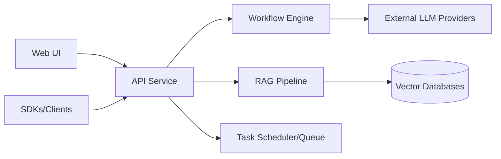

# langgenius/dify

> Plateforme auto-hébergeable pour construire des applis LLM : workflows visuels, RAG, agents, suivi.

## Le problème
Monter une appli LLM (prompts, RAG, outils, logs, API) demande d'assembler et de maintenir beaucoup de briques à la main.

## Ce que ça fait vraiment
Un canevas visuel compose des workflows ; un pipeline RAG ingère des documents (PDF, PPT…) et interroge une base vectorielle ; des agents disposent d'un bac à sable et d'outils (Marketplace Dify, serveurs MCP, API maison).
Des centaines de modèles propriétaires ou ouverts via des fournisseurs, dont tout modèle compatible OpenAI. Logs et annotations pour l'« LLMOps », intégrations Opik, Langfuse, Arize Phoenix. Chaque appli expose une API.
Côté code : backend `api/` (contrôleurs, services, tâches asynchrones), frontend `web/`, SDK Node/PHP/Python, déploiement `docker/`. L'analyse d'architecture fournie est générique : peu de noms de fichiers réels.

## Comment c'est branché


## Essayer
```bash
cd dify
cd docker
cp .env.example .env
docker compose up -d
```

## Coût et pièges
Minimum 2 cœurs et 4 Gio de RAM, Docker Compose ≥ 2.24. Dify Cloud offre 200 appels GPT-4 gratuits ; en auto-hébergement, les clés modèles sont à ta charge. SSO et RBAC relèvent de l'offre Enterprise.

## Ce que ce n'est pas
Pas une bibliothèque à importer : un serveur complet à opérer. Les fonctions d'entreprise (SSO, RBAC, SLA) ne sont pas dans l'édition communautaire. La licence n'est pas identifiée par GitHub : à lire avant un usage commercial.

## Alternatives
Aucune alternative nommée dans le README.

## Pour toi
À adopter pour prototyper vite un RAG ou un agent avec une interface ; pour du sur-mesure, le code reste préférable.
