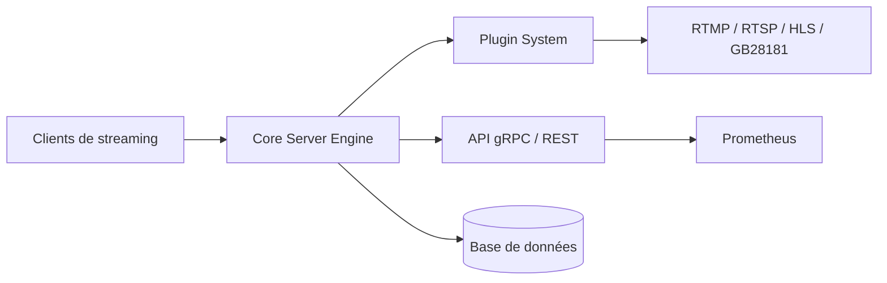

# langhuihui/monibuca

> Framework de serveur de streaming vidéo en Go, extensible par plugins, pour diffusion et enregistrement.

## Le problème
Diffuser et recevoir des flux vidéo en plusieurs protocoles demande un serveur adaptable et peu latent.

## Ce que ça fait vraiment
Un cœur Go gère éditeurs et abonnés ; des plugins ajoutent les protocoles (RTMP, RTSP, HTTP-FLV, HLS, WebRTC, GB28181, ONVIF, SRT), l'enregistrement (MP4, HLS, FLV), la cascade et les salles, le transcodage, les captures et des webhooks. Interface gRPC/REST, métriques Prometheus sur `/api/metrics`, bases (SQLite, MySQL, PostgreSQL, DuckDB) au choix par étiquettes de build. Le README cite aussi l'inférence ONNX.

## Comment c'est branché


## Essayer
```bash
cd example/default
go run -tags sqlite main.go
```
Puis ouvrir http://localhost:8080 avec `admin.zip` placé à côté du fichier de configuration.

## Coût et pièges
Go 1.23+. Licence AGPL-3.0 : un service réseau modifié doit publier ses sources. Les affirmations de performance du README ne sont pas chiffrées.

## Ce que ce n'est pas
Ce n'est pas un produit clé en main : c'est un cadre à compiler. Il n'est pas centré sur l'IA, malgré le module d'inférence cité.

## Alternatives
Aucune alternative nommée dans le README.

## Pour toi
À ignorer : serveur de streaming sans lien direct avec la data ou le MLOps, et l'AGPL contraint les usages commerciaux.

