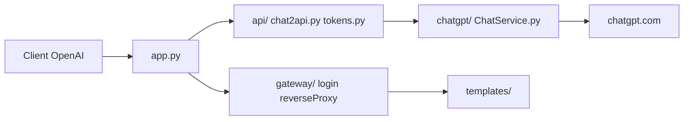

# lanqian528/chat2api

> Proxy qui expose l'interface web de ChatGPT sous forme d'API au format OpenAI, pour usage personnel.

## Le problème
Utiliser des clients compatibles OpenAI avec un compte ChatGPT sans passer par l'API officielle payante.

## Ce que ça fait vraiment
Le serveur Python (`app.py`, modules `api/`, `chatgpt/`, `gateway/`) traduit des requêtes `/v1/chat/completions` en appels vers chatgpt.com. Il accepte des AccessToken ou RefreshToken, fait tourner plusieurs comptes, réessaie en cas d'échec et rafraîchit les jetons. Il propose aussi un « miroir » du site officiel derrière `/login`, et un mode sans compte pour GPT-3.5. Le README est en chinois.

## Comment c'est branché


## Essayer
```bash
docker run -d \
  --name chat2api \
  -p 5005:5005 \
  lanqian528/chat2api:latest
```

## Coût et pièges
Il faut un AccessToken récupéré à la main sur chatgpt.com. Selon l'IP, erreurs 401/403/429 ; le README suggère un proxy ou une IP américaine. Le mode passerelle (`ENABLE_GATEWAY`) ouvre l'accès à quiconque atteint ton domaine.

## Ce que ce n'est pas
Ce n'est pas une API officielle : elle reproduit l'interface web (preuve de travail comprise) et peut casser à chaque changement côté OpenAI. Le README mentionne lui-même un réglage pour limiter les risques de bannissement de compte.

## Alternatives
Aucune alternative n'est citée dans le README.

## Pour toi
À ignorer : contournement fragile d'un service tiers, risque sur ton compte, un seul mainteneur, dernier push en mai 2025 ; prends l'API officielle pour tout usage sérieux.
