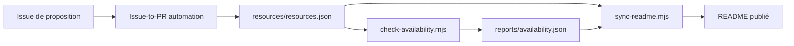

# laoma2053/awesome-zhuiju-free

> Liste chinoise de sites de streaming, torrents, sous-titres et sources IPTV, avec état de disponibilité vérifié chaque jour.

## Le problème
Les listes de liens vers des sites de séries pourrissent vite : domaines changés, sites morts, publicités envahissantes.

## Ce que ça fait vraiment
Un README (en chinois) classe des ressources par catégories : streaming en ligne, applications, recherche de disque réseau, magnets/BT, sous-titres, interfaces TVBox, sources IPTV, projets open source. Chaque ligne reçoit une note « multi, rapide, propre, stable » et un statut (🟢/🟡/🔴). Une GitHub Action contrôle chaque jour si la page d'accueil répond et réécrit le tableau. Le dépôt dit ne pas héberger de fichiers ni de liens vers des œuvres individuelles.

## Comment c'est branché

## Essayer
Rien à installer : consulter le README. Le README cite `resources/resources.json` et `reports/availability.json` pour les données brutes.

## Coût et pièges
Gratuit. Le README lui-même signale des risques de copyright, de sécurité, de vie privée et de paiement selon les sites, et beaucoup d'entrées demandent un contournement réseau (« 梯子 »). Les statuts reflètent l'état vu depuis les serveurs GitHub Actions.

## Ce que ce n'est pas
Ce n'est pas un service de lecture ni un moteur de recherche. Les sites listés n'ont pas été évalués pour leur licéité ; le README s'en décharge dans son avertissement.

## Alternatives
Aucune alternative nommée dans le README.

## Pour toi
Ignorer : hors sujet pour un profil data/IA/MLOps. Seul le montage (catalogue JSON, contrôle quotidien, README généré) peut inspirer une liste vivante.

