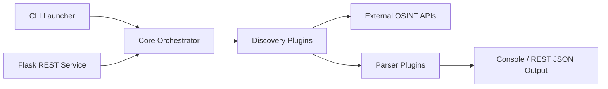

# laramies/theHarvester

> Collecte de renseignements ouverts sur un domaine, pour la phase de reconnaissance d'une évaluation autorisée.

## Le problème
Dresser l'inventaire des sous-domaines, adresses e-mail et IP associés à un domaine demande d'interroger de nombreuses sources publiques et d'en normaliser les résultats.

## Ce que ça fait vraiment
Une soixantaine de sources (moteurs de recherche, transparence des certificats, DNS passif, dépôts de code) sont interrogées, et les résultats normalisés sont conservés comme preuves dans une base SQLite locale. Trois interfaces partagent le même moteur : CLI, API REST et HarvestView (interface web locale, historique, planification, suivi des changements de noms d'hôtes). Les sources sont classées P0 (passif), P1 (requêtes DNS), P2 (contact direct de la cible) ; P1 et P2 exigent une sélection explicite.

## Comment c'est branché


## Essayer
```bash
git clone https://github.com/laramies/theHarvester.git
cd theHarvester
uv sync
uv run theHarvester -d example.com -b crtsh,certspotter
```

## Coût et pièges
Gratuit, GPL-2.0. Exige Python 3.14 et uv. Certaines sources demandent une clé d'API dans `api-keys.yaml`. Même en mode passif, les fournisseurs reçoivent la chaîne cible. Garder HarvestView sur la boucle locale ; ne jamais versionner clés ni résultats.

## Ce que ce n'est pas
Le README impose de ne l'exécuter que sur des cibles qu'on possède ou pour lesquelles on a une autorisation explicite ; les actions P1/P2 doivent être couvertes par le périmètre autorisé. Un indice de prise de contrôle de sous-domaine est un élément à examiner, pas une preuve.

## Alternatives
- SpiderFoot : couvre aussi personnes et identités, avec plus de modules (non nommé dans ce README, à titre de comparaison du même lot).

## Pour toi
À surveiller : sortie JSONL et base SQLite exploitables en pipeline, utile si tu fais de l'inventaire d'exposition ; sinon hors de ton cœur de métier.

