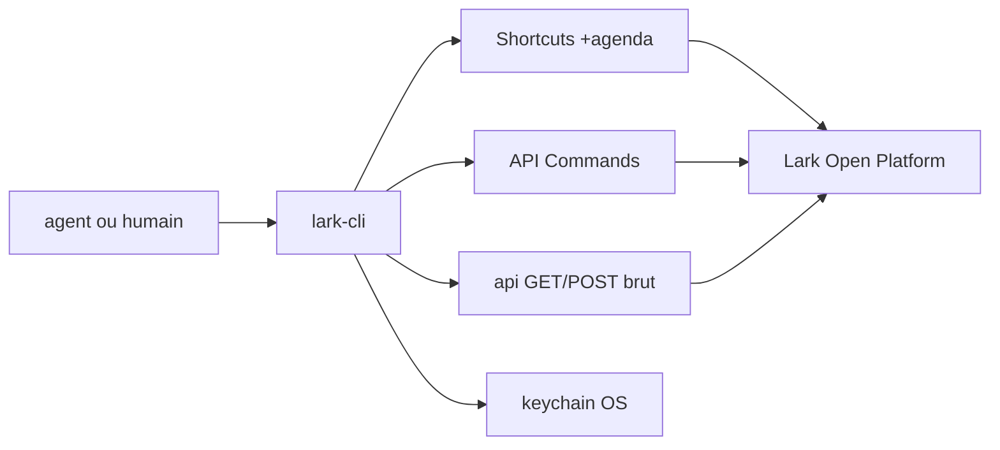

# larksuite/cli

> CLI officielle Lark/Feishu, pensée pour être pilotée par un agent autant que par un humain.

## Le problème
Piloter Lark/Feishu depuis un script oblige à écrire soi-même l'auth OAuth, la
pagination et le mapping des 2500+ endpoints de l'Open Platform.

## Ce que ça fait vraiment
Expose 18 domaines métier (Messenger, Docs, Base, Sheets, Slides, Calendar, Mail,
Tasks, Meetings, Wiki, OKR…) en 200+ commandes. Trois niveaux de granularité :
raccourcis `+xxx`, commandes API générées depuis les métadonnées OAPI, et appel
brut `lark-cli api GET /open-apis/...`. Livre 26 « Agent Skills » (`lark-calendar`,
`lark-im`, `lark-base`…) chargeables par un agent. Sortie json/pretty/table/ndjson/csv
avec une enveloppe de succès/erreur distincte, `--dry-run`, `--page-all`.

## Comment c'est branché


## Essayer
```bash
npx @larksuite/cli@latest install
lark-cli config init
lark-cli auth login --recommend
lark-cli calendar +agenda
```

## Coût et pièges
Gratuit (MIT) mais inutile sans tenant Lark/Feishu : il faut créer une app et
l'autoriser. Le CLI envoie par défaut des signaux de contrôle de risque (OS,
modèle de machine) ; `lark-cli config risk-control off` les coupe.

## Ce que ce n'est pas
Ce n'est pas un client universel de messagerie : c'est du Lark/Feishu uniquement.
Le README avertit lui-même que laisser un agent agir sous votre identité peut
exposer des données sensibles (hallucination, prompt injection), et déconseille
d'ajouter le bot à des groupes.

## Alternatives
- `meegle-cli` : le domaine Projet/Meegle, à installer séparément.
- Aucune autre alternative nommée dans le README.

## Pour toi
Sans tenant Lark, sans objet. À ignorer tant que la boîte n'est pas sur Feishu.
