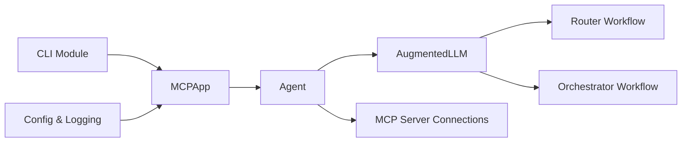

# lastmile-ai/mcp-agent

> Framework Python pour construire des agents sur le Model Context Protocol avec des patterns composables.

## Le problème
Brancher un agent sur plusieurs serveurs MCP oblige à gérer le cycle de vie des connexions, les outils, l'état et la reprise après panne.

## Ce que ça fait vraiment
`MCPApp` charge configuration, logs et moteur d'exécution ; un `Agent` déclare ses serveurs MCP ; un `AugmentedLLM` (OpenAI, Anthropic, Google, Azure, Bedrock) expose `generate_str` et `generate_structured`. Patterns prêts : parallèle, routeur, classifieur d'intention, orchestrateur, deep research, évaluateur-optimiseur, swarm. Passage à Temporal pour la durabilité sans changer le code ; une app peut s'exposer elle-même en serveur MCP.

## Comment c'est branché


## Essayer
```bash
uvx mcp-agent init
uv add "mcp-agent[openai]"
uv run main.py
pip install mcp-agent
uvx mcp-agent deploy my-agent
```

## Coût et pièges
Clé du fournisseur LLM à ta charge ; le déploiement sur mcp-agent Cloud suppose un compte (`uvx mcp-agent login`). Temporal ajoute un worker à opérer.

## Ce que ce n'est pas
Pas un produit fini ni une interface graphique : une bibliothèque de code. Dernier push en janvier 2026, 138 issues ouvertes.

## Alternatives
Aucune alternative nommée ; OpenAI Swarm n'est cité que pour la compatibilité du pattern swarm.

## Pour toi
À surveiller : approche propre (patterns d'Anthropic, durabilité Temporal, MCP natif) si tu bâtis des agents outillés, mais le rythme de commits ralenti incite à attendre avant d'en faire une base.
