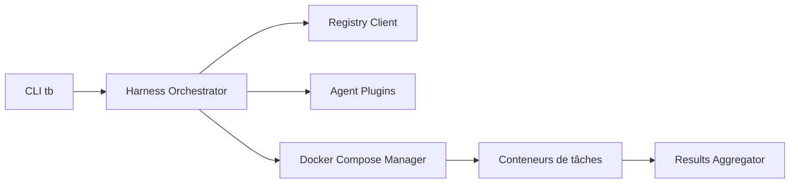

# laude-institute/terminal-bench

> Banc d'essai pour agents IA dans un vrai terminal : tâches de bout en bout et harnais d'exécution.

## Le problème
Comparer des agents sur des tâches système réalistes (compiler, installer, entraîner) manque d'un cadre reproductible.

## Ce que ça fait vraiment
Deux parties : un jeu d'environ 100 tâches (instruction en anglais, script de test, solution de référence) et un harnais qui relie un modèle à un terminal sandboxé sous Docker. La CLI `tb run` lance un agent sur un jeu de données versionné, avec un classement public. Le projet est en bêta.

## Comment c'est branché


## Essayer
```bash
uv tool install terminal-bench
tb run --help
tb run --agent terminus --model anthropic/claude-3-7-latest --dataset-name terminal-bench-core --dataset-version 0.1.1 --n-concurrent 8
```

## Coût et pièges
Docker et `uv` requis. Chaque évaluation consomme des appels à l'API du fournisseur de modèle, à ta charge, multipliés par le nombre de tâches et la concurrence.

## Ce que ce n'est pas
Ce n'est pas la version courante : le README invite les nouveaux utilisateurs à passer à harbor pour Terminal-Bench 2.0. Pas un outil pour entraîner un agent.

## Alternatives
- harbor : le nouveau cadre annoncé par le README pour exécuter Terminal-Bench 2.0.

## Pour toi
À surveiller : référence pour évaluer des agents, mais l'annonce de harbor indique que ce dépôt n'est plus le point d'entrée.
