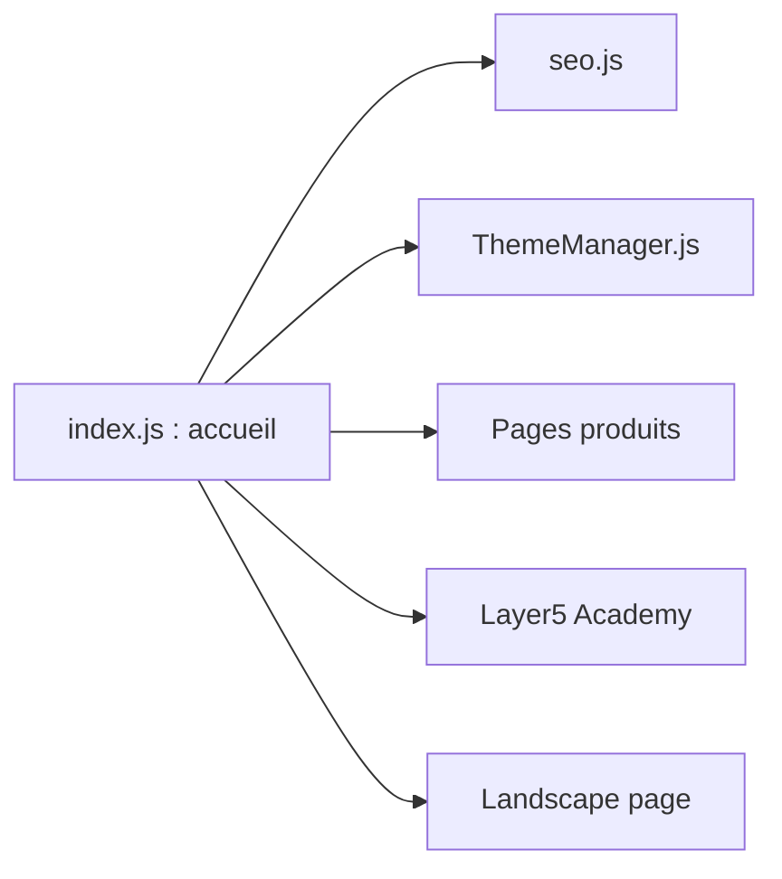

# layer5io/layer5

> Code du site web de Layer5, éditeur de Meshery, Kanvas et autres projets cloud native.

## Le problème
Le README ne décrit pas de problème technique : c'est la vitrine d'une organisation et de ses projets.

## Ce que ça fait vraiment
D'après le code, c'est un site Gatsby : page d'accueil, pages produits (Meshery, Kanvas, Cloud Native Catalog), communauté, Academy, livres, et une page « paysage » comparant les service meshes avec chronologie. Le README liste les projets (Meshery, Nighthawk, Sistent, Image Hub…) sans en détailler le fonctionnement.

## Comment c'est branché

## Essayer
Aucune commande documentée dans le README.

## Coût et pièges
Rien à installer pour un usage de lecture ; le contenu utile se trouve dans les dépôts des projets cités, pas ici. 164 issues ouvertes.

## Ce que ce n'est pas
Pas Meshery ni un outil de gestion d'infrastructure : c'est le site marketing. Le README est une liste de liens communautaires.

## Alternatives
Aucune alternative nommée dans le README.

## Pour toi
À ignorer : ce dépôt est un site vitrine ; regarde plutôt Meshery directement si le service mesh t'intéresse.

