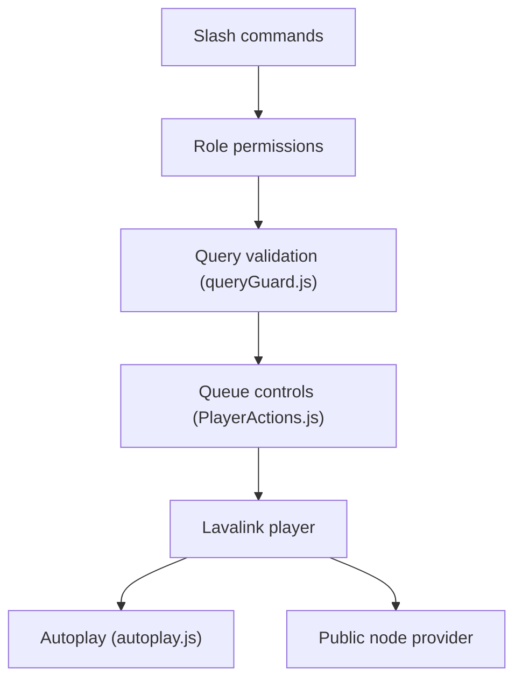

# lazaroagomez/BeatDock

> Bot Discord de musique reposant sur Lavalink, déployable en Docker pour qui gère un serveur Discord.

## Le problème
Les bots musicaux publics disparaissent ou limitent leurs fonctions ; héberger le sien demande d'assembler bot, serveur audio et jetons YouTube.

## Ce que ça fait vraiment
Commandes slash (`/play`, `/search`, `/queue`, `/lyrics`, `/filter`…) lisant YouTube, SoundCloud, Bandcamp, Twitch, Vimeo ; Spotify optionnel (résolu via YouTube). File d'attente, autoplay, contrôle d'accès par rôles, 5 langues. Sans Lavalink auto-hébergé, il se rabat sur des nœuds Lavalink publics : les requêtes y transitent.

## Comment c'est branché


## Essayer
```bash
mkdir beatdock && cd beatdock
# créer .env (TOKEN=...), docker-compose.yml et application.yml comme dans le README
docker compose up -d
docker compose pull && docker compose up -d --force-recreate   # mise à jour
```

## Coût et pièges
Jeton de bot Discord requis, avec les 3 Privileged Gateway Intents. YouTube bloque périodiquement les clients : un conteneur génère un poToken, et le README prévoit un repli SoundCloud.

## Ce que ce n'est pas
Pas un projet data/IA. Les vidéos restreintes par âge peuvent rester indisponibles ; sur nœuds publics, la lecture dépend de l'opérateur du nœud. Modifier `application.yml` exige `--force-recreate`.

## Alternatives
Aucune alternative nommée dans le README (Lavalink est la brique sous-jacente).

## Pour toi
Surveiller : bien documenté et actif, mais hors de ton périmètre data/IA ; utile seulement pour un serveur Discord perso.

