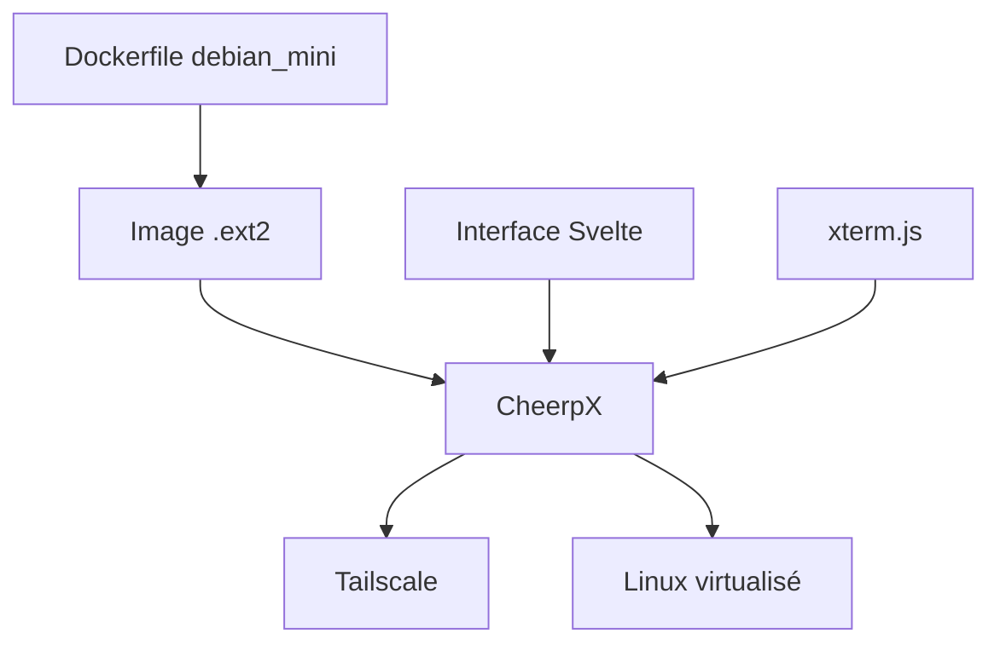

# leaningtech/webvm

> Machine virtuelle Linux qui s'exécute entièrement dans le navigateur, en WebAssembly, sans serveur.

## Le problème
Offrir un environnement Linux jetable et isolé (démonstration, enseignement, essais) sans installer ni héberger de machine.

## Ce que ça fait vraiment
Le moteur propriétaire CheerpX compile du x86 en WebAssembly à la volée, émule les appels système Linux et fournit un système de fichiers en blocs, ce qui fait tourner une Debian non modifiée (ou Alpine/Xorg/i3) dans l'onglet. Terminal xterm.js, réseau via Tailscale (ou Headscale). Tu peux fabriquer ta propre image `.ext2` à partir d'un Dockerfile et la déployer sur GitHub Pages. Une intégration Claude AI est proposée avec ta clé, stockée dans le navigateur.

## Comment c'est branché


## Essayer
```bash
git clone https://github.com/leaningtech/webvm.git
cd webvm
npm install
npm run build
nginx -p . -c nginx.conf
```

## Coût et pièges
Gratuit. L'image `debian_large` est trop grosse pour GitHub Pages. Pas de `ping` (ICMP absent), pas de `sudo`. La clé Claude reste dans ton navigateur mais est à ta charge. CheerpX est un composant tiers fermé.

## Ce que ce n'est pas
Ce n'est pas un bac à sable pour du calcul lourd : ni GPU ni performances natives.

## Alternatives
Le README cite Mini.WebVM (variante à partir d'un Dockerfile) et l'image alpine-image pour le bureau.

## Pour toi
À surveiller : utile pour des démonstrations ou du cours en Python sans installation, pas pour l'entraînement de modèles.

