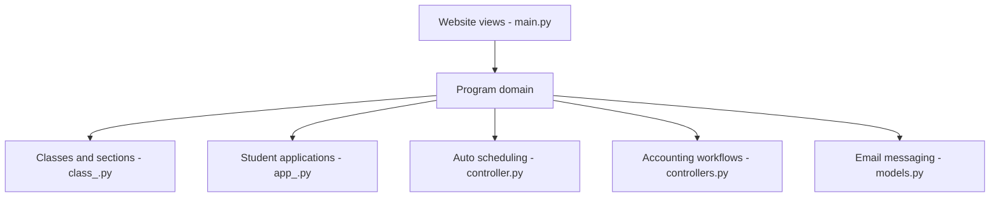

# learning-unlimited/ESP-Website

> Site Django pour organiser la logistique de programmes éducatifs courts, par la communauté Splash et Learning Unlimited.

## Le problème
Organiser un événement éducatif à grande échelle (inscriptions, classes, salles, emploi du temps, paiements) sans tableur ni outils dispersés.

## Ce que ça fait vraiment
Application Django qui gère programmes, classes et sections, candidatures d'élèves, ressources, emploi du temps automatique, comptabilité, enquêtes, e-mails, formulaires et thèmes configurables. Les modèles du domaine portent l'état (programme, classe, utilisateur, ressource). Le dépôt existe depuis 2011 et reste actif (dernier push 2026-09-18, 549 issues ouvertes).

## Comment c'est branché


## Essayer
```bash
git clone https://github.com/learning-unlimited/ESP-Website.git devsite
cd devsite
docker compose up --build
```
Puis ouvrir http://localhost:8000.

## Coût et pièges
Gratuit, nécessite Docker. La documentation détaillée est dans `docs/` et le wiki ; le README ne dit rien de la production.

## Ce que ce n'est pas
Pas un LMS ni une plateforme de cours en ligne : c'est de la logistique d'événements. Rien de lié à la donnée ou à l'IA.

## Alternatives
Aucune alternative nommée dans le README.

## Pour toi
À ignorer : sujet éloigné du profil data/IA/MLOps, mais fiche utile si tu organises un événement éducatif.

