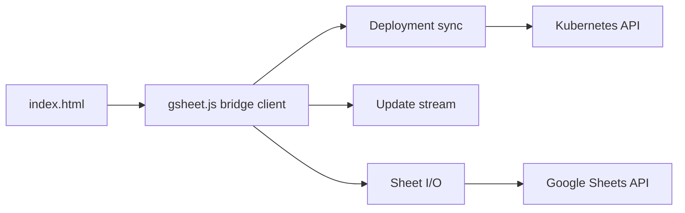

# learnk8s/xlskubectl

> Pont expérimental qui affiche les déploiements Kubernetes dans Google Sheets et permet d'en changer le nombre de réplicas.

## Le problème
Aucun besoin réel : le projet est présenté comme une blague (« ils se sont demandé si pouvait, pas si devait »).

## Ce que ça fait vraiment
Une page web servie par `kubectl proxy` charge les déploiements, les synchronise dans une feuille Google Sheets, suit les mises à jour via le flux de l'API Kubernetes ; modifier le nombre de réplicas dans la feuille met à l'échelle le déploiement. Tout le code client tient dans `gsheet.js`.

## Comment c'est branché


## Essayer
```bash
kubectl proxy --www=.
# puis ouvrir la page servie sur 127.0.0.1:8001 et suivre l'assistant d'identifiants Google
```

## Coût et pièges
Gratuit, mais crée des identifiants Google et expose le proxy kubectl. Aucune licence déclarée ; dernier push en septembre 2022.

## Ce que ce n'est pas
Pas un outil de production ; le README le dit lui-même en ironisant.

## Alternatives
Aucune alternative nommée dans le README.

## Pour toi
À ignorer : curiosité sans maintenance depuis 2022 et sans licence, risquée à brancher sur un cluster.

