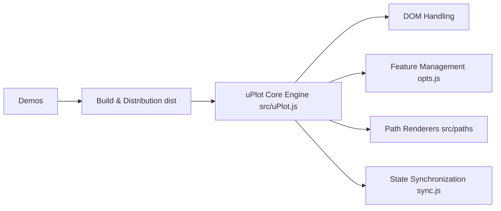

# leeoniya/uPlot

> Bibliothèque JavaScript Canvas 2D (~50 Ko) de graphiques de séries temporelles très rapides.

## Le problème
Les bibliothèques de graphiques web classiques deviennent lentes et gourmandes dès des centaines de milliers de points ou du streaming.

## Ce que ça fait vraiment
Trace lignes, aires, OHLC et barres en Canvas 2D ; 166 650 points en 25 ms à froid annoncés.
Axes Y multiples, échelles log, zoom, légende en direct, fuseaux IANA, données manquantes, curseurs synchronisés.
Renderers de chemins enfichables (linéaire, spline, escalier, barres) ; API de hooks et plugins.
Benchmark comparatif publié face à Chart.js, ECharts, Plotly, Highcharts…

## Comment c'est branché

## Essayer
Aucune commande d'installation documentée dans le README (voir `/docs/README.md` et `/demos`).

## Coût et pièges
Gratuit, MIT. Docs « en travaux » : l'API se lit dans `dist/uPlot.d.ts` et les démos.

## Ce que ce n'est pas
Pas d'agrégation ni de statistiques, pas d'animations, pas de séries empilées, pas de pan natif. Au-delà de ~100k points visibles, passer au WebGL.

## Alternatives
- danchitnis/webgl-plot, huww98/TimeChart, epezent/implot : WebGL/WebGPU pour les très gros volumes.
- uDSV : pour parser les données en amont.

## Pour toi
À surveiller : excellent pour un dashboard de métriques d'entraînement ou de monitoring en temps réel côté front, un wrapper Python existe aussi.
