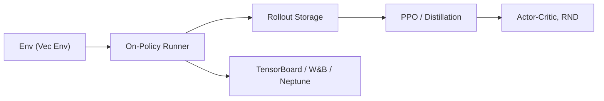

# leggedrobotics/rsl_rl

> Bibliothèque d'apprentissage par renforcement sur GPU, compacte, pour la robotique (PPO, distillation).

## Le problème
Les grandes bibliothèques RL sont lourdes à modifier ; les chercheurs en robotique veulent un code court pour tester une idée.

## Ce que ça fait vraiment
Implémente PPO et la distillation élève-enseignant, avec acteur-critique (récurrent ou non), normalisation, exploration RND et augmentation par symétrie. Entraînement multi-GPU, suivi TensorBoard, Weights & Biases ou Neptune. Utilisée par Isaac Lab, Legged Gym, mjlab et MuJoCo Playground.

## Comment c'est branché


## Essayer
```bash
pip install rsl-rl-lib
git clone https://github.com/leggedrobotics/rsl_rl
cd rsl_rl
pip install -e .
```

## Coût et pièges
Gratuit. Il faut un environnement de simulation fourni ailleurs (Isaac Lab, etc.). Licence présente mais non identifiée par GitHub : à lire.

## Ce que ce n'est pas
Pas un environnement ni un catalogue d'algorithmes : seulement des méthodes on-policy ; d'autres algorithmes existent sur des branches (mentionné par le schéma).

## Alternatives
Non documenté dans le README.

## Pour toi
Ignorer : brique de robotique RL sans usage direct pour un profil data/MLOps, sauf si tu passes par Isaac Lab ou mjlab.
