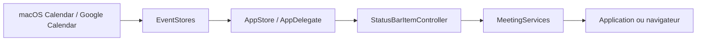

# leits/MeetingBar

> Application macOS de barre de menus qui affiche la prochaine réunion et permet de la rejoindre en un clic.

## Le problème
Retrouver le lien de la prochaine visioconférence dans son agenda fait perdre quelques minutes avant chaque réunion.

## Ce que ça fait vraiment
Lit l'agenda macOS ou Google Calendar, détecte les liens de réunion (50+ services : Meet, Zoom, Teams, Webex, Discord), affiche la réunion en cours ou suivante dans la barre de menus, rappels et notifications plein écran, raccourci global, intégrations Raycast, Raccourcis et AppleScript. Écrit en Swift 6 ; ne collecte pas de données personnelles selon le README.

## Comment c'est branché


## Essayer
```bash
brew install --cask meetingbar
```

## Coût et pièges
Gratuit. macOS 12 minimum. Google Calendar passe par une authentification OAuth à configurer dans l'application.

## Ce que ce n'est pas
Pas un outil de transcription ni d'enregistrement de réunion. Pas disponible hors macOS.

## Alternatives
Aucune alternative nommée dans le README.

## Pour toi
À ignorer côté data/IA : utilitaire de confort réservé à macOS, sans rapport avec un pipeline.

