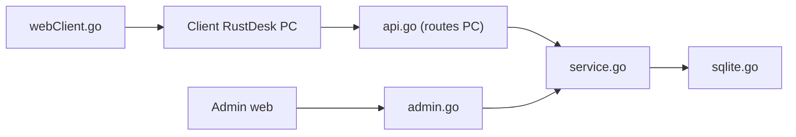

# lejianwen/rustdesk-api

> Serveur d'API RustDesk en Go avec administration web et client web pour gérer ses accès distants.

## Le problème
Le serveur RustDesk de base n'offre ni carnets d'adresses, ni groupes, ni journaux, ni gestion d'utilisateurs auto-hébergés.

## Ce que ça fait vraiment
Implémente les routes du client PC (login, carnet d'adresses, groupes), une console d'administration (utilisateurs, appareils, journaux de connexion et de transfert, commandes serveur) et un client web, avec partage par lien invité. Connexion GitHub, Google, OIDC et LDAP. Base SQLite ou MySQL. Le README est en chinois.

## Comment c'est branché


## Essayer
```bash
docker run -d --name rustdesk-api -p 21114:21114 \
    -v /data/rustdesk/api:/app/data \
    -e RUSTDESK_API_RUSTDESK_ID_SERVER=192.168.1.66:21116 \
    -e RUSTDESK_API_RUSTDESK_RELAY_SERVER=192.168.1.66:21117 \
    -e RUSTDESK_API_RUSTDESK_API_SERVER=http://192.168.1.66:21114 \
    -e RUSTDESK_API_RUSTDESK_KEY=<key> \
    lejianwen/rustdesk-api
./apimain reset-admin-pwd <pwd>
```

## Coût et pièges
Gratuit. L'administrateur initial est `admin`, mot de passe affiché en console : à changer. Meilleur couplé au fork lejianwen/rustdesk-server.

## Ce que ce n'est pas
Pas un serveur de relais : il faut un serveur RustDesk à côté. Dernier push fin septembre 2025.

## Alternatives
lejianwen/rustdesk-server, serveur compagnon recommandé par le README.

## Pour toi
Administration d'accès distants sans lien avec data/IA : ignorer.

