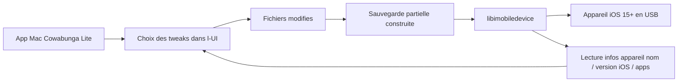

# leminlimez/CowabungaLite

> **A macOS app that customises an iOS 15+ iPhone without jailbreaking it.**

## The problem

Changing the status bar, the app icons or the Control Center of an iPhone used to require a
jailbreak, meaning a weakened device stuck on an old iOS version. Without a tool of this
kind, those settings simply are not reachable: Apple does not expose them in Settings.

## What it actually does

It is a Mac application, connected to the iPhone over cable, that applies "jailed" tweaks:
icon theming through WebClips, carrier name changes, number of WiFi/cellular bars, battery
capacity, time and date text in the status bar, Control Center modules, Springboard animation
speed, a lock screen footnote, internal diagnostic toggles, and setup options such as Skip
Restore Setup and supervision. The location changer is listed for iOS 16 and earlier only.

## How it is wired



The README sums it up in one sentence: the tool applies tweaks by creating a partial restore
of only the files being changed, without wiping the device. libimobiledevice creates the
backups, restores them to the device and reads device information (name, iOS version, home
screen apps). The rest is a plain Xcode project; no other component is documented.

## Trying it

There is no install command: download the .zip matching your macOS version and run the app,
then plug in your phone. To build it yourself, the README gives one command, run inside the
folder containing the xcodeproj:

```bash
xcodebuild CODE_SIGNING_ALLOWED=NO -scheme Cowabunga\ Lite -configuration release
```

## Cost and traps

Free, with optional Ko-Fi support. You need a Mac on macOS 11 Big Sur or later (a virtual
machine or hackintosh is accepted) and a device on iOS 15.0 or later; Find My must be off
while applying, and the device must not be under MDM with backup encryption. The real risk is
stated by the README itself: back up first, the authors take no responsibility for damage,
you must pick "Do Not Transfer Apps and Data" if the transfer screen shows up, and on iOS
17.2+ you must click "Continue with Partial Setup" or the phone's data will be erased.
GPL-3.0 is copyleft, worth checking before reusing any code.

## What it is not

It is not a jailbreak and does not open the device to arbitrary tweaks: the scope is the list
of toggles in the README, nothing more. It is not cross-platform either — a Mac is required,
no Windows or Linux build is mentioned. And it is not risk-free for your data: the warnings
about wiping the phone are explicit.

## Alternatives

The README names Cowabunga, by the same author, whose code and UI are partly reused — the
non-"Lite" variant. It also names TrollTools, source of the icon theming UI and of some
Springboard option keys: worth a look if icon theming is the only thing you want. No
comparable neighbour is provided in the catalogue.

## For you

Nothing here touches data / AI / MLOps work: it is iPhone customisation driven from a Mac.
Ignore it as professional tooling; keep it in mind only for personal use, and read the
warnings before clicking.
