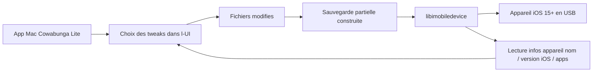

# leminlimez/CowabungaLite

> **Application macOS qui modifie l'apparence d'un iPhone iOS 15+ sans jailbreak.**

## Le problème

Personnaliser la barre d'état, les icônes ou le centre de contrôle d'un iPhone demandait
jusqu'ici un jailbreak, donc un appareil vulnérable et une version d'iOS figée. Sans outil de
ce type, ces réglages restent inaccessibles : Apple ne les expose pas dans les Réglages.

## Ce que ça fait vraiment

C'est une application Mac, branchée sur l'iPhone par câble, qui applique des retouches
« jailed » (sans jailbreak) : thématisation des icônes via WebClips, modification du nom de
l'opérateur, du nombre de barres WiFi/cellulaire, de la capacité de batterie, de l'heure et
du texte de date affichés dans la barre d'état, activation de modules du centre de contrôle,
vitesse des animations du Springboard, note de bas d'écran sur l'écran verrouillé, options de
diagnostic internes et options de configuration initiale (Skip Restore Setup, supervision).
Le changement de localisation est annoncé pour iOS 16 et antérieur uniquement.

## Comment c'est branché



Le README l'explique en une phrase : l'outil applique les tweaks « en créant une restauration
partielle des seuls fichiers modifiés, sans effacer l'appareil ». C'est
[libimobiledevice](https://libimobiledevice.org) qui crée les sauvegardes, les restaure sur
l'appareil et lit ses informations (nom, version d'iOS, apps de l'écran d'accueil). Le reste
du dépôt est un projet Xcode ; le README ne détaille aucun autre composant.

## Essayer

Aucune ligne de commande d'installation : « télécharge simplement le .zip correspondant à ta
version de macOS et lance l'application. Branche ton téléphone et commence. » Pour compiler
soi-même, le README donne une commande, à lancer dans le dossier contenant le xcodeproj :

```bash
xcodebuild CODE_SIGNING_ALLOWED=NO -scheme Cowabunga\ Lite -configuration release
```

## Coût et pièges

Gratuit (soutien optionnel via Ko-Fi). Il faut un Mac sous macOS 11 Big Sur ou plus (machine
virtuelle ou hackintosh acceptés) et un appareil sous iOS 15.0 ou plus ; Find My doit être
désactivé pendant l'application, et l'appareil ne doit pas être sous MDM avec chiffrement des
sauvegardes. Le risque réel est là : le README demande de sauvegarder son appareil avant
usage, prévient que les auteurs ne sont pas responsables des dommages, impose de choisir
« Do Not Transfer Apps and Data » si l'écran de transfert apparaît, et avertit les
utilisateurs d'iOS 17.2+ qu'il faut cliquer sur « Continue with Partial Setup » sous peine de
voir les données du téléphone effacées. Licence GPL-3.0 : copyleft, à surveiller en cas de
réutilisation de code.

## Ce que ce n'est pas

Ce n'est pas un jailbreak et ça n'ouvre pas l'appareil à des tweaks arbitraires : le
périmètre est la liste de bascules du README, rien de plus. Ce n'est pas non plus un outil
multiplateforme — il faut un Mac, aucune version Windows ou Linux n'est mentionnée. Et ce
n'est pas sans risque pour les données : les avertissements du README sur l'effacement
potentiel du téléphone sont explicites.

## Alternatives

Le README cite [Cowabunga](https://github.com/leminlimez/Cowabunga), du même auteur, dont une
partie du code et de l'UI est reprise — la variante non « Lite ». Il cite aussi
[TrollTools](https://github.com/sourcelocation/TrollTools), d'où viennent l'UI de
thématisation d'icônes et des clés d'options Springboard : à regarder si c'est surtout le
thème d'icônes qui intéresse. Aucun voisin comparable n'est fourni dans le catalogue.

## Pour toi

Aucun rapport avec un usage data / IA / MLOps : c'est de la personnalisation d'iPhone depuis
un Mac. À ignorer côté outillage professionnel ; à garder en tête seulement pour un usage
personnel, et alors en lisant les avertissements avant de cliquer.
