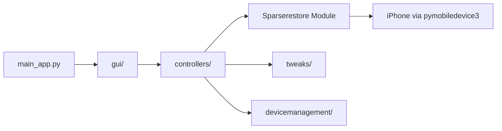

# leminlimez/Nugget

> Outil de bureau qui modifie des réglages cachés d'un iPhone via un exploit de restauration.

## Le problème
iOS n'expose pas certains réglages (barre d'état, démons, fond d'écran animé, drapeaux internes).

## Ce que ça fait vraiment
Interface PySide6 (et CLI) qui, via pymobiledevice3, exploite sparserestore (iOS 17.0–18.1.1) ou BookRestore (18.2–26.1) pour écrire hors zone de restauration : PosterBoard, barre d'état, options SpringBoard, désactivation de démons, MobileGestalt, feature flags. Les tweaks MobileGestalt et AI Enabler ne sont pas supportés sur iOS 26.2 et plus.

## Comment c'est branché


## Essayer
```bash
python3 -m venv .env
source .env/bin/activate
pip3 install -r requirements.txt
python3 main_app.py
```

## Coût et pièges
Gratuit. Sous Windows il faut iTunes ou Apple Devices, sous Linux usbmuxd et libimobiledevice. Le README avertit : à ne pas utiliser sur iOS 27, risque de perte de données ; sauvegarder d'abord.

## Ce que ce n'est pas
Pas un outil durable : Apple a patché la méthode sur les versions récentes. Aucune garantie sur l'état de l'appareil.

## Alternatives
CowabungaLite (lien du README, sans commentaire) ; aucune autre alternative décrite.

## Pour toi
À ignorer : bricolage d'appareil iOS reposant sur un exploit qui se ferme, sans lien avec data/IA/MLOps.

