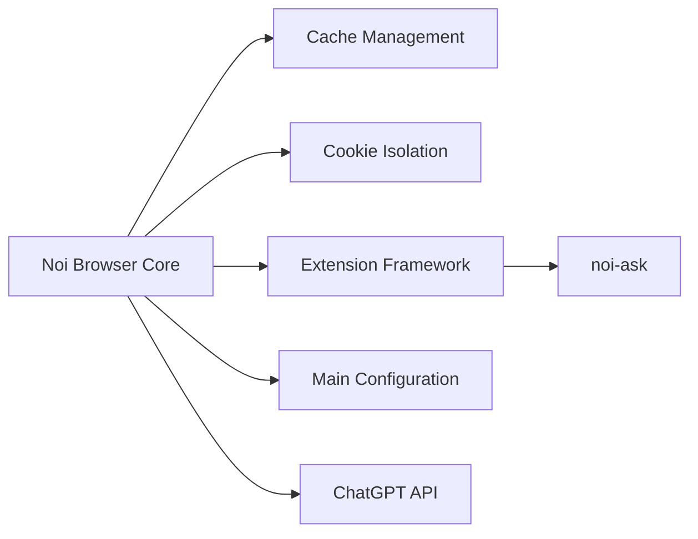

# lencx/Noi

> Navigateur de bureau orienté chats IA, avec sessions isolées, prompts et terminal intégré.

## Le problème
Jongler entre plusieurs interfaces de chat IA (ChatGPT, Claude…) dans un navigateur classique mélange sessions et prompts.

## Ce que ça fait vraiment
Selon la liste de fonctions : multi-fenêtres, isolation des sessions, données locales (historique, prompts, réglages), gestion de prompts, terminal intégré, commande `noi` pilotable depuis Claude Code, Codex ou Gemini CLI, thèmes. L'architecture décrit une app Electron avec extensions (`noi-ask`, `noi-export-chatgpt`…) et i18n. Le README ne donne ni installation ni détail d'usage.

## Comment c'est branché

## Essayer
Aucune commande documentée dans le README (seulement un lien « Download »).

## Coût et pièges
Gratuit ; les services IA ouverts dans le navigateur ont leurs propres abonnements. Aucune licence déclarée : réutilisation du code juridiquement floue.

## Ce que ce n'est pas
Pas un client API ni un outil d'orchestration : c'est un navigateur qui encapsule les sites web des chats. README trop maigre pour juger la maturité.

## Alternatives
Aucune alternative nommée dans le README.

## Pour toi
À ignorer : utilitaire de confort sans licence et au README quasi vide, qui n'apporte rien à un travail data/MLOps au-delà d'ouvrir des chats dans des onglets.
