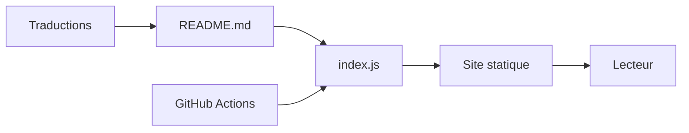

# leonardomso/33-js-concepts

> Guide en ligne de 33 notions de JavaScript, avec explications, exemples et ressources, pour développeurs.

## Le problème
Apprendre JavaScript sans base solide sur les fermetures, la boucle d'événements ou les prototypes mène à des bogues récurrents.

## Ce que ça fait vraiment
Le README liste les concepts par thèmes (fondamentaux, fonctions, plateforme web, POO, asynchrone, fonctionnel, avancé) et des notions étendues (hoisting, Proxy, stockage navigateur, observers, JSON). Chaque entrée renvoie à un cours sur 33jsconcepts.com ; une quarantaine de traductions existent. Le dépôt contient surtout du texte, un `index.js` et une CI.

## Comment c'est branché

## Essayer
Aucune commande documentée : lire le contenu sur 33jsconcepts.com.

## Coût et pièges
Gratuit, aucune installation. Le rôle exact de `index.js` et l'hébergement sont déduits par l'outil d'architecture, non confirmés par le README.

## Ce que ce n'est pas
Ce n'est pas un cours interactif ni un dépôt de code réutilisable.

## Alternatives
Aucune alternative nommée dans le README.

## Pour toi
Ignorer : contenu de formation JavaScript sans rapport direct avec un profil data, sauf pour monter un front.

