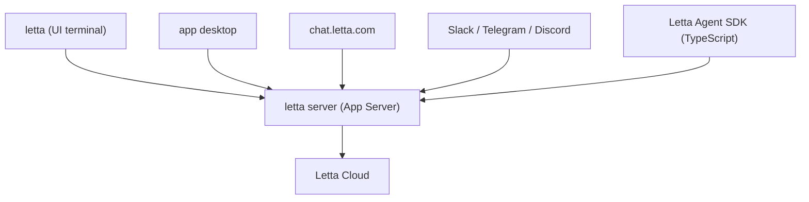

# letta-ai/letta

> Agents à mémoire persistante ; ce dépôt n'est plus qu'un panneau indicateur vers le vrai code.

## Le problème
Un agent LLM repart de zéro à chaque session : rien de ce qu'il a appris hier ne survit.
Letta (ex-MemGPT) traite la mémoire comme un état de première classe.

## Ce que ça fait vraiment
Le README annonce explicitement que le code actif vit dans `letta-ai/letta-code` : harnais d'agent,
UI terminal interactive, App Server, canaux, runtime des apps desktop et web. Ce dépôt-ci conserve
la branche `archive`, qui contient le serveur d'API Letta V1 retiré, avec tags et releases.
Aucune description technique du fonctionnement n'est donnée ici.

## Comment c'est branché


## Essayer
```bash
npm install -g @letta-ai/letta-code
letta
letta server
```

## Coût et pièges
Letta Cloud est le chemin par défaut pour garder mémoire, identité et conversations entre machines :
c'est un service hébergé, donc un compte et une facture potentielle. Rien n'indique ici le coût de
l'auto-hébergement ni les modèles LLM requis.

## Ce que ce n'est pas
Pas le dépôt à cloner : le code est ailleurs, et ce README le dit. Pas une doc technique — il faut
aller sur la documentation Letta pour toute information d'installation ou de déploiement.
La branche `archive` est explicitement retirée, pas un point de départ.

## Alternatives
- `letta-ai/letta-code` : le dépôt réellement développé, nommé dans le README.

## Pour toi
Passe directement à `letta-code` ; ce dépôt ne sert qu'à récupérer l'historique V1.
