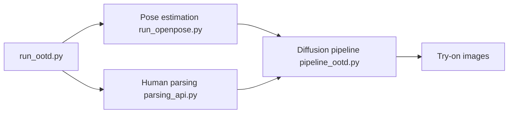

# levihsu/OOTDiffusion

> Implémentation officielle d'un essayage virtuel par diffusion latente, avec modèles demi-corps et corps entier.

## Le problème
Visualiser un vêtement sur une personne sans photo réelle.

## Ce que ça fait vraiment
À partir d'une photo de personne et d'un vêtement, le pipeline estime la pose (OpenPose) et segmente le corps (humanparsing, ONNX supporté), puis un UNet de diffusion fusionne vêtement et personne. Checkpoints VITON-HD (demi-corps) et Dress Code (corps entier). Une démo Gradio est fournie.

## Comment c'est branché


## Essayer
```bash
conda create -n ootd python==3.10
pip install torch==2.0.1 torchvision==0.15.2 torchaudio==2.0.2
pip install -r requirements.txt
cd OOTDiffusion/run
python run_ootd.py --model_path <model-image-path> --cloth_path <cloth-image-path> --scale 2.0 --sample 4
```

## Coût et pièges
GPU nécessaire ; checkpoints et `clip-vit-large-patch14` à télécharger. Testé uniquement sous Ubuntu 22.04. Licence non identifiée.

## Ce que ce n'est pas
Le code d'entraînement n'est pas publié (case non cochée). Dernier push en mai 2024.

## Alternatives
Aucune alternative nommée dans le README.

## Pour toi
À ignorer : code figé depuis 2024, licence incertaine, sans entraînement : utile seulement comme référence de lecture.

