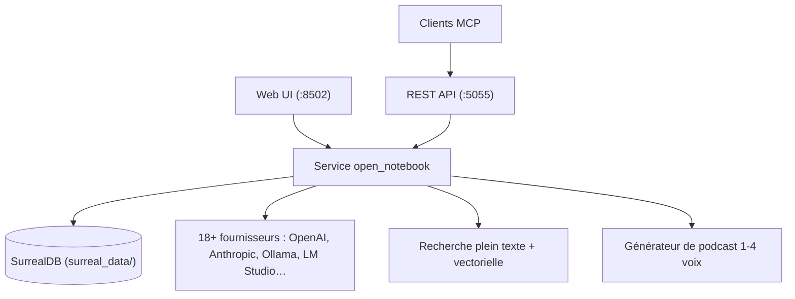

# lfnovo/open-notebook

> Alternative auto-hébergée à NotebookLM : sources, chat, recherche et podcasts multi-voix.

## Le problème
Confier ses documents de recherche à un service fermé impose son modèle, ses limites et son
hébergement, sans API pour automatiser quoi que ce soit.

## Ce que ça fait vraiment
Organise des notebooks multiples contenant PDF, vidéos, audio, pages web et documents bureautiques.
Laisse choisir parmi 18+ fournisseurs de modèles, dont Ollama et LM Studio en local, avec des
assignations par défaut par usage.
Cherche en plein texte et en vectoriel sur l'ensemble du contenu, et fait discuter un modèle avec
un contrôle fin de ce qu'on lui transmet, citations à l'appui.
Génère des podcasts à 1 à 4 voix avec profils d'épisode et contrôle du script. Expose une API REST
complète, une intégration MCP vers Claude Desktop ou VS Code, et une protection par mot de passe
optionnelle pour les déploiements exposés.

## Comment c'est branché


## Essayer
```bash
curl -o docker-compose.yml https://raw.githubusercontent.com/lfnovo/open-notebook/main/docker-compose.yml
# éditer OPEN_NOTEBOOK_ENCRYPTION_KEY
docker compose up -d
# puis http://localhost:8502
```

## Coût et pièges
Gratuit hors modèles, à ta charge, sauf en local avec Ollama. Deux points de vigilance dans le
compose fourni : `OPEN_NOTEBOOK_ENCRYPTION_KEY` vaut `change-me-to-a-secret-string` par défaut et
chiffre tes clés d'API en base ; SurrealDB démarre en `root:root`, port lié à `127.0.0.1` seulement.
Le README annonce lui-même des citations « basiques » en retrait face à NotebookLM.

## Ce que ce n'est pas
Ce n'est pas un clone à parité : le tableau comparatif du README concède le terrain des citations.
Ce n'est pas encore asynchrone : le traitement de contenu bloque l'interface, c'est annoncé
comme à venir. Ce n'est pas multi-notebooks pour les sources : leur réutilisation est à venir.

## Alternatives
- **Google NotebookLM** : le produit fermé dont il se veut l'alternative.

## Pour toi
Le bon compromis si tu veux un NotebookLM sur tes documents sensibles, avec une API pour scripter.
