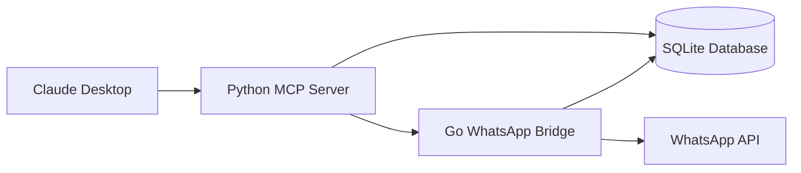

# lharries/whatsapp-mcp

> Serveur MCP qui donne à Claude ou Cursor un accès lecture/écriture à ton WhatsApp personnel.

## Le problème
Un agent LLM ne peut ni chercher dans tes conversations WhatsApp ni y envoyer de messages : tout reste enfermé dans l'application mobile.

## Ce que ça fait vraiment
Un pont Go (bibliothèque whatsmeow, API web multi-appareils) s'authentifie par QR code et copie l'historique dans SQLite.
Un serveur MCP Python expose une douzaine d'outils : recherche de contacts, liste des messages et des chats, contexte d'un message.
Envoi de messages, de fichiers et de messages vocaux (conversion .ogg Opus via FFmpeg, optionnel).
Les médias ne sont que des métadonnées tant qu'on n'appelle pas `download_media`.

## Comment c'est branché


## Essayer
```bash
git clone https://github.com/lharries/whatsapp-mcp.git
cd whatsapp-mcp
cd whatsapp-bridge
go run main.go
```
Puis déclarer `uv --directory …/whatsapp-mcp-server run main.py` dans `claude_desktop_config.json` ou `~/.cursor/mcp.json`.

## Coût et pièges
Go, Python, uv et un client MCP requis ; réauthentification environ tous les 20 jours. Sous Windows, CGO et un compilateur C sont obligatoires.

## Ce que ce n'est pas
Pas une API WhatsApp officielle : c'est ton compte personnel piloté par un client non officiel. Le README prévient lui-même du « lethal trifecta » : une injection de prompt peut exfiltrer tes messages privés.

## Alternatives
Aucune alternative nommée dans le README.

## Pour toi
À surveiller seulement : bel exemple d'architecture MCP pont + base locale, mais brancher un LLM sur sa messagerie privée sans garde-fou contre l'injection est un risque que peu de contextes pros justifient.
