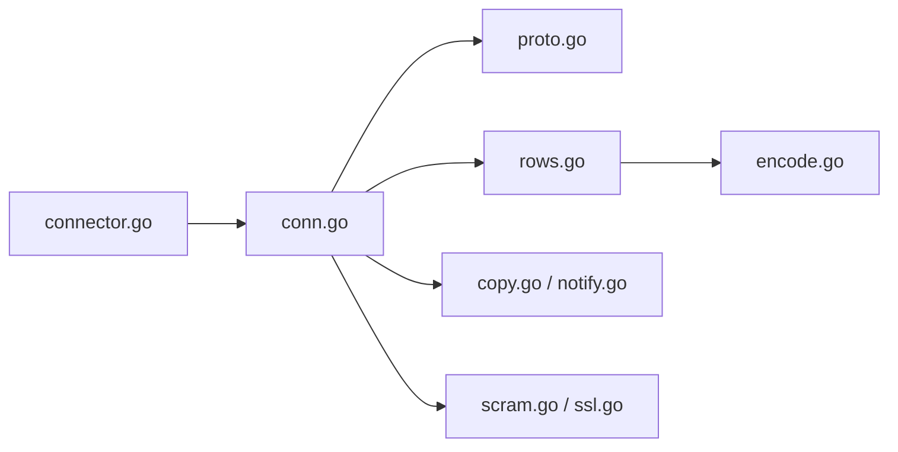

# lib/pq

> Pilote PostgreSQL en Go pour `database/sql`.

## Le problème
Un programme Go doit parler à PostgreSQL via l'interface standard.

## Ce que ça fait vraiment
Implémente le protocole PostgreSQL : DSN compatible libpq (et paramètres d'exécution comme `search_path`), authentification mot de passe, MD5, SCRAM-SHA256, Kerberos en module séparé, TLS, `COPY ... FROM STDIN`, `LISTEN/NOTIFY`, tableaux et hstore, erreurs typées `pq.Error`. Débogage du protocole avec `PQGO_DEBUG=1`.

## Comment c'est branché


## Essayer
```go
db, err := sql.Open("postgres", "host=localhost dbname=pqgo connect_timeout=5")
err = db.Ping()
```
```bash
docker compose up -d
```

## Coût et pièges
Gratuit. Ajouter `connect_timeout` (sinon attente infinie). `LastInsertId` non supporté : utiliser `RETURNING`. Les `timestamp` sans fuseau reçoivent une zone fixe vide, pas UTC. Licence non identifiée par GitHub.

## Ce que ce n'est pas
Pas un ORM. Le README ne cite pas d'alternative ; le fichier de licence est à relire.

## Alternatives
Aucune alternative nommée dans le README.

## Pour toi
À adopter en Go pour PostgreSQL (pipelines, services de données) : maintenu en 2026, mais lis le fichier LICENSE avant de l'intégrer.

