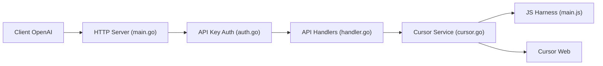

# libaxuan/cursor2api-go

> Service Go qui expose Cursor Web comme une API compatible OpenAI chat/completions.

## Le problème
Utiliser les modèles accessibles via Cursor depuis n'importe quel client compatible OpenAI, sans API officielle.

## Ce que ça fait vraiment
Reçoit des requêtes chat, les traduit en appels vers Cursor Web, puis renvoie les événements parsés en flux ou non. Gère clé d'API, outils (tool_calls), variantes « -thinking » dérivées et un point de santé. Un harnais JavaScript sous Node.js reproduit l'environnement navigateur. Modèle documenté : gemini-3-flash.

## Comment c'est branché


## Essayer
```bash
git clone https://github.com/libaxuan/cursor2api-go.git
cd cursor2api-go
./start.sh
curl -H "Authorization: Bearer 0000" http://localhost:8002/v1/models
```

## Coût et pièges
Gratuit, mais repose sur un compte Cursor et sur le contournement de protections (token x-is-human, empreinte navigateur). Clé par défaut « 0000 ». README en chinois ; erreurs 403 et Cloudflare citées.

## Ce que ce n'est pas
Pas une API officielle : peut casser à tout moment et enfreindre les conditions d'usage (le README renvoie lui-même à les respecter). Le README annonce PolyForm Noncommercial, usage commercial interdit, alors que GitHub ne reconnaît pas la licence.

## Alternatives
Aucune alternative nommée dans le README.

## Pour toi
À ignorer : détournement d'un service tiers, licence non commerciale et risque de rupture ; passe par une API officielle.

