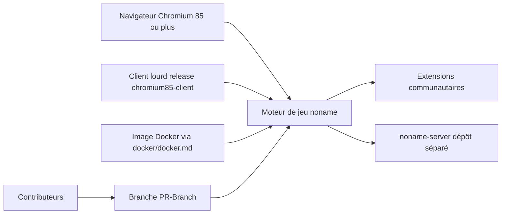

# libccy/noname

> **Chinese card game "Noname", playable in a browser or as a client, extended by its community.**

## The problem

Without this repository there is no free, extensible version of the 无名杀 card game: players are
left with closed clients or obfuscated forks. The README never states the problem it solves; it
assumes the reader already knows the game and comes either to download it or to contribute.

## What it actually does

The README describes neither the architecture nor the game features. What can be extracted: this
is the reference repository for the game, playable as a web page (a Chromium-based browser with a
kernel version of at least 85 is recommended) and also shipped as a desktop client through the
`chromium85-client` release, plus a Docker deployment documented in `docker/docker.md`. The
`noname-server.exe` server lives in a separate repository, `nonameShijian/noname-server`. The rest
of the README is links to the contribution wiki and a long public statement against the
"无名杀十周年" fork, accused of violating GPL-3.0 and of obfuscating output built from open code.

## How it is wired



Three entry points to the same engine — web page, packaged client, Docker container — a server
hosted outside this repository, and an ecosystem of extensions whose compatibility depends on the
core version (the README insists that extensions using post-1.10 features do not run on forks
stuck at 1.9.124). Contributions must be pushed to the `PR-Branch` branch.

## Trying it

```bash
# No install or run command is documented in this README.
# It points to the "chromium85-client" release and to ./docker/docker.md,
# whose contents are not reproduced here.
```

The README provides no command line, so nothing is reconstructed here.

## Cost and traps

Free, no API key, no account. The main trap is legal and community-related rather than technical:
the code is under GPL-3.0 (copyleft), which the README recalls at length regarding a fork accused
of breaching it — any redistribution or derivative must publish its sources. Technical trap named
in the README: a browser or Android webview with a kernel older than version 85 is unsupported,
and older Firefox versions are discouraged. Finally, the README is Chinese-only and links to a
Chinese wiki, which makes contributing hard without the language.

## What it is not

It is not a general-purpose, reusable piece of software: it is a game, with no announced API or
library. Nor is it technical documentation — more than half the README is a position statement
against a fork rather than a presentation of the product. And it is not "无名杀十周年", which the
README explicitly calls an unaffiliated fork of v1.9.124, not a newer official release.

## Alternatives

The README names no alternative as such. It mentions two related repositories:
`nonameShijian/noname-server` (the server, complementary rather than competing) and the
"无名杀十周年" fork, which the README explicitly advises against. No catalogue neighbours were
supplied: no comparable alternative in the catalogue.

## For you

Unrelated to a data / AI / MLOps profile: no model, no pipeline, no reusable building block. File
it as a curiosity — at best as a case study in GPL-3.0 licence conflict inside an open source
community. Move on.
